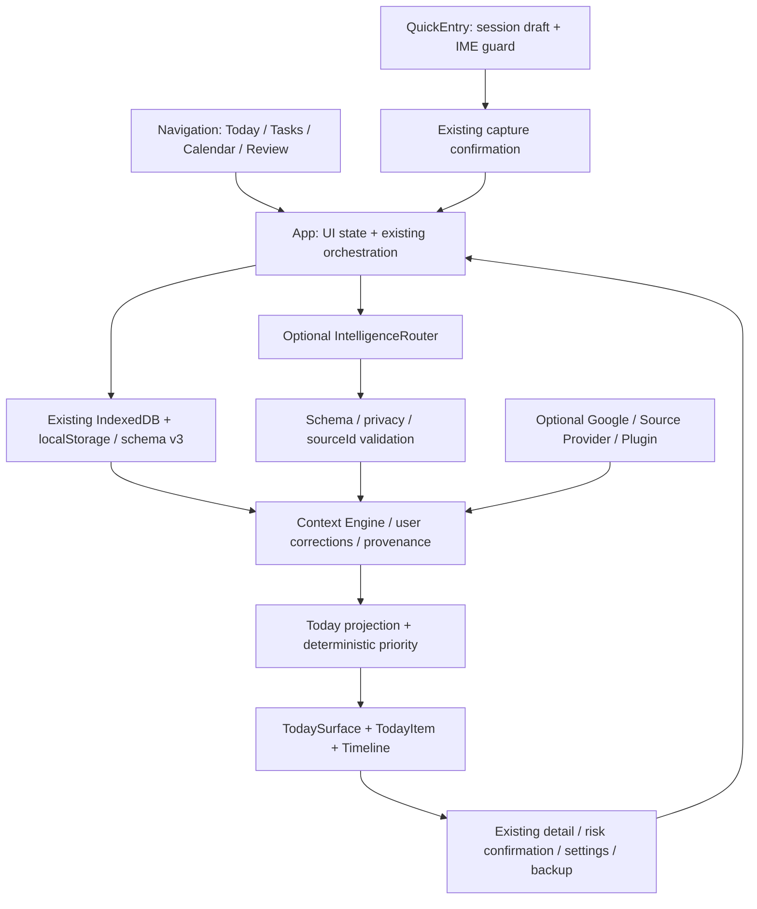

# Today V2 architecture

## 変更した層

Reactの表示と画面選択、下書きstate、CSS、SVG icons、カレンダーの表示用sort、検証・文書・release工程。`App`が既存Applicationと保存・同期・確認を接続し、`Navigation`と`TodaySurface`が表示を担当する。V2を巨大な新しい1画面componentにしない。

画面変更はReact commit後に移動先h1へfocus。既に選択中の画面を押した場合にも同じfocusとscrollを行う。画面選択は保存しない。QuickEntryの下書きはAppに置き、確認を開くだけでは消さない。保存を確定したときに消す。外部サービスへの送信権限には変換しない。

## 保存と互換

DB / store / mirrorの名前、schema v3、backup形式、Context / Item / Provider契約は維持する。カレンダーは既存の投影項目を利用し、raw sourceの新しい権限を作らない。ISO offsetを含む日時はDateのinstantとして比較する。event startを先に用い、未指定ならdeadlineを用いる。all-dayは既存のlocal-date方針を維持し、同時刻は元の順序を維持する。不正日時は表示sortで除外する。

## 既存境界の継承

- AIはproposalだけを返し、Contextの確定やstate / remote serviceの書込みを直接行わない。
- 手動操作のrisk policyとconfirmation、queue / idempotency、source / user / derived provenance、Context訂正は既存処理。
- Node serverのHost / Origin / CSP、local MLX / Ollama境界、optional Remote providerのHTTPS / TLS / redirect拒否を維持。
- Service Workerは同じoriginで初回cache後のofflineを支援。初回offline installや任意originの共有保存を提供しない。
- Pluginは同一プロセスのtrusted extensionで、OS sandboxではない。

詳細は既存[Architecture](docs/ARCHITECTURE.md)と[Threat model](docs/SECURITY_MODEL.md)。本V2作業ではモデル学習パイプラインを実行しない。
