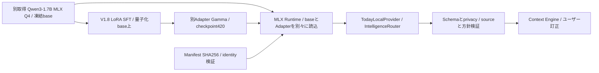

# Today V1.9 — Implementation and Release Qualification

検証日: 2026-09-28。対象: **1.9.0-rc.1**。実行環境: macOS / Apple Silicon、Node24.19.0、pnpm11.19.0、Playwright1.63.0 / Chromium153。これは公開前のソース候補の報告です。

## 1. Executive Summary

**ローカルRCの検証は合格。`OSS_RELEASE_READY = NO`。**

Today本体はMIT、Copyright 2026 **Kaito Kuon**。権利者の明示確認を反映しました。V1.8の機能・Domain/Context/Provider architectureを凍結し、セキュリティ、任意設定の隔離、async資源管理、配布・NOTICE・SBOM・CI・ドキュメントを整備しました。モデル重み・Adapter・研究datasetは配布しません。

163件の自動テスト、47フローの通常E2Eが合格。別保存Gammaのmanifest検証・実MLX起動・AI無効化の3フローも合格ですが、モデル品質を再評価したものではありません。Lighthouseは3回ともPerformance99 / Accessibility100 / CLS0。クリーンなGit取得とソースアーカイブ展開でinstall/build/test/startを確認しました。

NOの理由はコードテストの不合格ではありません。**公開GitHub先が未指定で、GitHub上の実CI、license detection、default branch/保護設定、非公開脆弱性報告経路が未検証**です。公開設定のチェックリストは用意しましたが、存在しない公開リポジトリを検証済みとしません。V2公開前に実施し、判定を更新する必要があります。この作業でpublic repository/tag/releaseは作成していません。

## 2. V1.8からの変更

| 対象             | 修正・理由                                                       | 根拠                                    |
| ---------------- | ---------------------------------------------------------------- | --------------------------------------- |
| 署名・cookie     | UTF8 byte長比較、base64url形式制限、cookie map null-prototype    | security Unicode regression             |
| HTTP URL         | try内のparse、HostとURL origin検査、400で生存                    | raw absolute-target / Host / CSRF tests |
| OAuth            | TTL掃除、512容量、検証後single-use、wrong-sessionでconsumeしない | OAuth tests、512+expiry回帰             |
| 任意model設定    | fd/サイズ上限64KiB、不正設定をモデルだけへ隔離                   | malformed/oversized manifest tests      |
| Providerのasync  | available+infer共通期限、cancel後infer禁止、世代情報finally解放  | release-regression / intelligence tests |
| MLX lifecycle    | 検証deduplicate、停止中の遅延spawn禁止、owned childを失わず停止  | local runtime6tests                     |
| HTTP応答         | model64KiB / Google4MiB、redirect拒否、期限                      | transport/security tests                |
| usage metadata   | 任意オブジェクトを返さず整数counterだけ                          | helper境界＋remote round-trip test      |
| 保存・Plugin     | prototype key拒否、importance厳密化、read-only action risk検証   | storage/Plugin malformed regressions    |
| Service Worker   | mutable shell no-cache、旧Today cacheだけ削除                    | cache corruption / unrelated cache E2E  |
| cold development | React dedupeとprebundle entryを明示                              | cold3回＋fresh clone＋artifact、後述    |
| 配布             | weights/Adapter/training/研究telemetryをソースから分離           | tree/manifest/archive scan              |
| Release工程      | MIT/NOTICE/SBOM、固定Action、formatゲート、setup/運用資料        | inventory/CI相当ローカル検証            |

新規dependencyはdevの**Prettier3.8.0（MIT）だけ**。format CIのためでproduction依存は増えていません。全体のPrettier整形はDomain変更ではありません。研究datasetに依存していたラベル分布の1テストは、dataset非配布に合わせて外し、その理由を記録しました。Coreのrelationship/Contextテストは維持し、新規回帰を追加しています。

## 3. Full Code Audit

[全パターン台帳](docs/qualification/code-audit.json) に各file/line/categoryとSAFE / DOCUMENTED / RELEASE_BLOCKER分類を保存。修正済み事項は上表と変更commitで追跡します。残るRELEASE_BLOCKERは0です。

TODO/FIXME/HACK/XXX/temporary、debug/mock/placeholder、loopback/絶対path、disabled checks、catch、unsafe assertion/any、network/resource budget、migration/experimentalを全候補テキストへ走査しました。private username/path/鍵/メールは別のsecret/privacy scanです。strict TypeScript、noUnusedLocals/noUnusedParameters、eslintに加え、Domain/Context/provenance、application/sync/user action、OAuth/token、AI/runtime、storage/backup/SW/modal、Provider/Plugin契約、build/CI/docsを手動レビューしました。

- SAFE: 完全架空fixture、Mock専用応答、入力placeholder、意図的scanner positive fixture。
- FIXED: 上表のUnicode、URL、Map/期限、optional設定、型/risk、cache/lifecycleの欠陥。
- DOCUMENTED: 個人端末loopback、任意provider fallback、信頼済み同一process拡張、Experimental枝、保守的な型narrowing、明示resource limit。
- RELEASE_BLOCKER: 候補コードに既知の未解決critical/high問題は検出されていません。GitHub公開工程は別の未完了ゲートです。

unused/dead/unreachableは型/lintと呼出経路を確認。Calendar/GmailのOAuth・HTTP境界に残る共通処理は独立serviceの明示実装で、凍結中の大規模統合は行いません。移行はpersisted version3への正規化を維持します。外部上流LICENSE/NOTICEはコード監査と別に帰属台帳で確認します。これは静的検査と手動レビューの範囲で、全行の形式証明や第三者侵入テストではありません。

## 4. Architecture Invariant Audit

[Architecture](docs/ARCHITECTURE.md) の各不変条件について既存/回帰/E2Eを再実行しました。

| 不変条件                   | 結果・範囲                                                               |
| -------------------------- | ------------------------------------------------------------------------ |
| AIなしCore                 | PASS: zero-key/no-model、手動capture/保存/完了/undo                      |
| Context semantic authority | PASS: 決定的relationship方針、SOURCE/USER/DERIVED、ユーザー訂正          |
| modelはproposal            | PASS: schema/sourceId/confidence/fingerprint検証、直接state mutationなし |
| User authority             | PASS: high-risk確認、sample返信に送信操作なし。Sourceはread-only         |
| Provider replaceability    | PASS: Domain/UIへvendor SDKを追加せず契約tests維持                       |
| Plugin failure             | PASS: permission/不正正規化/例外でDEGRADED、Core維持。sandboxではない    |
| Provenance                 | PASS: projection/context/source recovery tests                           |
| Privacy                    | PASS: connected-service/sensitive remote拒否、manual consent二重         |
| Offline                    | PASS: 保存済み起動・capture・persist・reconnect。初回offlineは対象外     |

## 5. Security Review / Accepted Risks

[Threat register](docs/SECURITY_MODEL.md) にXSS/CSRF/OAuth/PKCE/session/token、redirect/path/command/prototype、deserialization/supply chain/model/Plugin、prompt injection/indirect injection/schema/operation、SSRF/権限/log/storage/replay/resource exhaustionを分類しています。

本番CSP、React文字列描画、127.0.0.1 bind、Host/POST Origin/header、CSPRNG stateとPKCE S256、session結合とTTL/single-use、AES-256-GCM、wx0600/temp rename、body/応答/manifest上限、schemaとsafe actionを確認しました。暗号化tokenの16並列更新・改竄検出・権限試験も実行しています。

Accepted risks:

- 同じOSユーザーや侵害済み端末は鍵/ブラウザ保存へアクセス可能。itemsは平文です。
- Plugin/Provider/Pythonは信頼する同一process/ローカルコードでsandboxではありません。CPU無限loopを強制隔離できません。
- operatorが指定したHTTPS remoteのDNS再解決/IP固定は未実装。browser入力から任意endpointを構成できません。
- available()の内部処理自体は契約上cancel不能の場合があり、結果の採用は期限で止めます。
- 大量のローカルOS接続、全保存/cache破損、未知のsupply-chain問題を完全防御しません。
- directoryが既に存在するときの権限や親directory書換権限、同一OSユーザーのTOCTOUは利用者の管理範囲です。

## 6. Privacy / Secret Scan

[Privacy/reset](docs/PRIVACY.md)、[rights/provenance](docs/licensing/RIGHTS_PROVENANCE.md)、[配布除外記録](docs/qualification/release-exclusions.json) を整備。架空JSON5つはCore回帰fixtureとしてMIT配布し、training/private benchmark/Shadow recordsと分離しています。user-authorized公開名義以外の開発者private path/name、実Gmail/Calendar、credentialを公開候補へ入れません。

candidate treeと利用可能な新規Git historyをpattern scanし、検出0、要手動確認メール0。vendor原文のcopyright/contactと、架空home pathの意図的scanner fixtureだけを明示例外にします。元V1.8にGit履歴はなく、未知の過去履歴まで検査したとは主張しません。final commitとarchiveの結果は隣接release receiptで確定します。pattern scanは任意のPIIの不存在を証明しないため、配布境界とfixtureの手動確認を併用しています。

バックアップはmanual非sample項目だけ。Google token/取得メール/Calendar/Shadow記録は含めません。外部レビューへ送ったのは匿名化した短いcodeと技術症状だけです。モデルのreasoningや任意usage metadataをAPIの診断へ返しません。

## 7. Dependencies / SBOM / License

[固定依存台帳](docs/qualification/dependencies.json): **298components**。exact name/version、integrity、purpose、direct/transitive、license、runtime/開発用途、配布必要性、帰属/変更/既知advisory snapshotを記録しています。[CycloneDX1.5 SBOM](SBOM.cdx.json) は298components / 299 dependency graph entriesでlockと照合。UNKNOWN licenseは0です。platform optionalの未導入分も固定npm版のintegrity照合で補完しました。

[pnpm audit snapshot](docs/qualification/dependency-audit.json): info/low/moderate/high/criticalすべて0。これは2026-09-28の既知advisoryで、未知の欠陥がないという保証ではありません。Vite6系とwhatwg-encoding等のmaintenance/deprecationは残り、凍結下で不要なmajor更新は行いません。

Today source/自作図形icons/架空fixtureはMIT、Kaito Kuon。ユーザーが権利と公開名義を最終確認しました。外部写真/フォント/商用iconpackはありません。React/ReactDOM/SchedulerのMIT原文、Vite modulepreload helper、保守的なRollup生成helperのNOTICEを[THIRD_PARTY_NOTICES](THIRD_PARTY_NOTICES.md)へ保存。開発依存の上流LICENSE/NOTICEも保持しています。依存・QwenをTodayのMITで再許諾しません。

Qwen固定revisionのApache-2.0本文を原文確認し、同梱参照LICENSEのSHAはbase manifestと一致します。Qwen重み/Adapter/training dataは今回非配布で、Gamma独立公開のデータ来歴・許諾・変更表示・派生配布条件まで確認完了したとは扱いません。Core source公開とは別の審査です。[MIT原典](https://opensource.org/license/mit)、[Apache原典](https://www.apache.org/licenses/LICENSE-2.0)、[Qwen固定LICENSE](https://huggingface.co/Qwen/Qwen3-1.7B-MLX-4bit/blob/21457c6f51ed54a7c16e988c0844db973815c137/LICENSE)。

## 8. Today Model Gamma

**NOT_INCLUDED / Experimental。DEFAULTへ昇格しません。** 固定Qwen3-1.7B-MLX-4bitを凍結baseとして、V1.8にMLX量子化base上のLoRA SFTを実施した別Adapterです。rank8 / 8layers / 840iterations / selected420。base重みを更新したモデルや融合済み重みではありません。**Qwenを教師にした蒸留はしていません。V1.9で学習・蒸留・量子化・合成教師データ生成は行っていません。**

| V1.8 sealed V4（再学習していない既知結果） | 値           |
| ------------------------------------------ | ------------ |
| Context False Merge                        | 0/40         |
| Context Recall                             | 40/40        |
| Fact Extraction                            | 12/32 — FAIL |
| Temporal Understanding                     | 9/32 — FAIL  |

V1.9で別保存の実Gammaをhash検証し、MLX bridge loadと停止・AI無効Coreを確認しました。推論品質benchmarkやFact/Temporal改善の証拠ではありません。Python3.12.14 / mlx0.32.2 / mlx-lm0.31.3。今回のMac上のQwen処理は**ファイルhash検証と短いruntime起動/停止**で、学習や長い評価loopはありません。MLXの学習はCoreの起動経路にありません。source archiveから利用者が自動取得する仕組みもありません。

Q4は取得済みbaseの形式です。Adapter後に新しい融合モデルを量子化する処理は今回の経路にありません。V1.9 sourceにはQ/Aの重みを含めません。setupと範囲は[Model guide](docs/MODELS.md)、[Model card](models/today-model/model-card/MODEL_CARD.md)。

## 9. Provider / Plugin status

| 対象                        | 実環境の判定               | 実施した検証                                                                 |
| --------------------------- | -------------------------- | ---------------------------------------------------------------------------- |
| Gmail                       | NOT_CONFIGURED             | MOCK_VERIFIED_ONLY: OAuth/history/metadata/lazy body/取消、架空E2E           |
| Calendar                    | NOT_CONFIGURED             | MOCK_VERIFIED_ONLY: OAuth/PKCE/read-only/cache/取消                          |
| Generic Remote / OpenAI互換 | NOT_CONFIGURED             | MOCK_VERIFIED_ONLY:実HTTPテストserver、鍵/HTTPS/schema/privacy/timeout/usage |
| legacy OpenAI入力補助       | NOT_CONFIGURED             | MOCK_VERIFIED_ONLY:手動入力、malformed/cancel/disabled                       |
| Ollama                      | NOT_CONFIGURED             | MOCK_VERIFIED_ONLY: local endpoint/model/schema/think:false。実daemonなし    |
| MLX/Gamma                   | Experimental、NOT_INCLUDED | 別導入実runtimeのhash/load/unloadのみREAL_VERIFIED                           |
| 読書会Source Plugin         | MOCK_VERIFIED_ONLY         | LOCAL_SAMPLE/read-only、manifest/permission/failure/risk                     |
| Custom契約                  | MOCK_VERIFIED_ONLY         | 契約tests。第三者実装/本物serviceは未検証                                    |

実credentialsがないproviderの接続を強制せず、MockをReal Verifiedと表示しません。AI完全停止にはlegacyアシストOffとintelligence DISABLEDの2つが必要で、docs/UI/E2Eで明示しています。

## 10. Clean-Room / Reproducibility

Gitを初期化したcandidateを`git clone --no-local`で独立directoryへ取得。既存node_modules/dist/env/modelなし、credentialsを含まない環境でREADMEのprerequisitesとinstall/build/test/startを実行。新node_modulesをfrozen lockから作り、元と別directoryのproduction JS SHAは一致しました。pnpmのdownload cacheと同じMac/OSは共有しており、別OSや完全air-gap installの検証ではありません。

zero-key、AI disabled、no-model、empty first、invalid optional manifest/config、migration正規化、corrupt mirror→IndexedDB、invalid backup保持、corrupt shell online再取得、unrelated cache保護、offline/reconnect、文書化したbrowser resetを確認。offline初回、両DB全面破損の完全復旧は対象外です。local model setupは別導入の任意機能で、source/READMEの通常起動に不要です。

### cold developmentの一度の失敗

初回cloneのdevelopment scenarioで`Cannot read properties of null (reading useState)`を1度検出しました。productionは成功し、その後の再試行/旧cache除去でも再現しません。React各1版、production hash一致を確認し、dedupe/prebundle entryを明示しました。対策後の独立cold3回、fresh clone、artifact初回の合計5cold起動は例外0でした。

これは**緩和・再現性確認で、root causeの因果証明ではありません**。pageerror assertionを維持し、再発時はreleaseを止め、stack/optimizer/HMR/module identityを取得します。大規模再設計や新依存は追加しません。[Vite dedupe](https://vite.dev/config/shared-options#resolve-dedupe)、[prebundle設定](https://vite.dev/config/dep-optimization-options)を参照しました。

## 11. CI / Complete test counts

[Workflow](.github/workflows/release-qualification.yml)はcheckout/pnpm/setup-nodeを上流で確認した固定commitへpinし、contents:read、fork PRへsecretを渡さない構成です。format/lint/typecheck/unit/domain/contracts/integration/security/secret/license/audit/build/E2Eを自動化。Node22のUbuntu jobを定義しましたが、**GitHub ActionsはNOT_RUN**。ローカルMac/Node24で同じゲートを実行しました。成功badgeは表示しません。

| suite                                 | unique tests / 結果                |
| ------------------------------------- | ---------------------------------- |
| Vitest UI/domain/contract/Google mock | 17files / 130 PASS                 |
| local runtime Node                    | 6 PASS                             |
| remote Node / bridge integration      | 9 PASS                             |
| Ollama Node                           | 3 PASS                             |
| HTTP/security/token/resource          | 11 PASS                            |
| OSS scanners                          | 4 PASS                             |
| **合計**                              | **163 PASS、fail/skip0**           |
| 通常E2E                               | 6scripts / **47flows PASS**        |
| 別保存実Gamma smoke                   | **3flows PASS**、通常CI/配布対象外 |

同じsuiteをclone/artifactで再実行した回数をunique件数へ加算していません。cold反復は再現性確認で、50個の新しいtestを生成した意味ではありません。[集計](docs/qualification/test-results.json)。testは本文をmirrorするだけではなく、Unicode、Map容量/expiry、hang/cancel、malformed/権限/改竄/競合/破損/オフラインの失敗条件を対象にしています。

## 12. Performance / Accessibility

[Lighthouse集計](docs/qualification/performance.json)。Lighthouse13.5.0、Chromium153、production、空状態/無モデル、mobile412×823、simulated slow4G/CPU×4、3回。

| 指標              | V1.8 baseline     | V1.9                  |
| ----------------- | ----------------- | --------------------- |
| Performance       | 99/99/99          | **99/99/99**          |
| Accessibility     | 100/100/100       | **100/100/100**       |
| Median FCP        | 1.351s            | **1.357s**            |
| Median LCP        | 1.961s            | **1.966s**            |
| CLS / TBT         | 0 / 0ms           | **0 / 0ms**           |
| Initial JS / gzip | 357.63 / 111.96KB | **358.19 / 112.13KB** |
| CSS / gzip        | 23.29 / 5.12KB    | **23.30 / 5.12KB**    |

差は小さく、性能向上とは主張しません。UI E2Eでkeyboard/Escape/focus復帰、reduced-motion、dark mode、320/375/390/430/768/1024/1440pxの横overflow0を再確認。Lighthouse100は全画面/全支援技術の完全なアクセス性の保証ではありません。dedupe追加前後でproduction JS hashが同じなので、UI性能の測定対象も維持されています。

## 13. Documentation / Contributor setup

README/LICENSE/NOTICE/THIRD_PARTY_NOTICES/SECURITY/CONTRIBUTING/CODE_OF_CONDUCT/CHANGELOG、architecture/configuration/privacy/security/provider/plugin/model/model card/troubleshooting/development/testing/release/rightsを整備しました。READMEだけで通常起動し、Mac固有絶対pathや秘密鍵・Qwenを要求しません。実装済み/Experimental/未設定を区別し、model/dataの公開権利をソースlicenseと混同しません。

GitHub description/topics、main保護、issue/PR template、version/semantic policy、private vulnerability reportingの設定案も用意しています。実際のpublic owner/URL/連絡経路は未確定で、GitHub UIでのlicense detectionや設定完了を主張しません。

## 14. Release Artifact

ソースを固定Git treeからarchiveし、別directoryへ展開してfrozen install/build/163tests/47E2E/startとscanを実行しました。Git metadata、node_modules/dist、`.env.local`、token/private records、重み/Adapter/training、developer logsを含めません。モデルmanifestは参照metadataのみです。

final reportを含む最終ソースarchiveのSHA-256、commit、file inventory、内容一致、final install/build/test/startの実行結果は、隣接する**`Today-1.9.0-rc.1-RELEASE_RECEIPT.md`**とchecksumファイルで確定します。報告のchecksum自己参照を避け、preflightとfinalのsoftware payload同一性を比較します。変更がmaterialなら再検証する方針です。

## 15. External AI consultations

[相談・不同意log](docs/qualification/EXTERNAL_AI_REVIEW.md)。DeepSeekの**思考モード**でsecurity/async/resourceとcold startupを2回レビューし、Sakana Chat/Namazuでも独立security案を取得。コードは最小匿名化、実データ/鍵/認証情報/private pathなし。提案の採否とテストはCodexが独立に判断しました。

URLの不正percentを必ずTypeErrorとする過大な説明、router内部に追加HTTP409/TTLを要する提案、Sakanaの「HTML/20tests作成」を実行済みtestとして扱うことは採用しません。実URL/server、世代finallyとactive予算、実テスト結果で判断しました。追加coldレビューもroot cause未確定と明示し、上限付き確認を採用しています。ChatGPTのMIT案は権利の事実とせず、ユーザーの最終承認と公開名義を得て反映しました。

## 16. Known limits / Remaining blockers

### 公開前に残るゲート

1. 公開GitHub先・ownerを指定し、正確な候補treeを取得できることを確認。
2. GitHub Actionsの実実行を成功させる（現在はローカル相当のみ）。Ubuntu/Node22の未実測を隠さない。
3. default branch、MIT detection、branch保護、非公開脆弱性報告・管理者経路をGitHubで確認。
4. final archive/commit/SHAと公開候補の対応を保持してV2の公開判断を行う。

本物Google/remote/Ollamaのcredentialsなし、Gammaの品質未達と非配布、他OS/ブラウザ全組合せ未測定、未知脆弱性、trusted Plugin、平文ローカル保存は既知の範囲/accepted riskです。任意providerの未設定や分離されたExperimental model品質だけをCoreの成功として隠したり、強制接続したりしません。cold developer例外はroot cause未証明の緩和記録を残し、再発時に止めます。

## 17. Final Release Matrix

| Gate                               | 判定                                                |
| ---------------------------------- | --------------------------------------------------- |
| FEATURE_COMPLETE                   | YES（V1.8の凍結機能）                               |
| ARCHITECTURE_FROZEN                | YES                                                 |
| FULL_CODE_AUDIT                    | PASS（記載のscope）                                 |
| CLEAN_CLONE                        | PASS（独立ローカルGit clone）                       |
| INSTALL                            | PASS                                                |
| BUILD                              | PASS                                                |
| UNIT_TEST                          | PASS                                                |
| INTEGRATION_TEST                   | PASS（Mock/実テストserverを区別）                   |
| E2E                                | PASS（47通常＋3別導入runtime）                      |
| SECURITY_AUDIT                     | PASS（accepted riskと検証範囲あり）                 |
| SECRET_SCAN                        | PASS（candidate＋available history＋artifact）      |
| PRIVACY_AUDIT                      | PASS                                                |
| DEPENDENCY_AUDIT                   | PASS（2026-09-28 snapshot）                         |
| LICENSE_AUDIT                      | PASS（今回のsource配布範囲）                        |
| SBOM                               | COMPLETE（298components）                           |
| DOCUMENTATION                      | COMPLETE（公開GitHub固有の設定完了は未確認）        |
| CONTRIBUTOR_SETUP                  | PASS（Mac/Node24、cold緩和記録あり）                |
| ZERO_KEY_MODE                      | PASS                                                |
| AI_DISABLED_MODE                   | PASS                                                |
| NO_MODEL_MODE                      | PASS                                                |
| LOCAL_MODEL                        | NOT_INCLUDED（実験的外部Gamma runtime smokeは合格） |
| REMOTE_PROVIDER                    | NOT_CONFIGURED（MOCK_VERIFIED_ONLY）                |
| RELEASE_ARTIFACT                   | VERIFIED（final receiptとの対応が必要）             |
| GITHUB_ACTIONS / PUBLIC_REPOSITORY | NOT_RUN / NOT_CONFIGURED                            |
| **OSS_RELEASE_READY**              | **NO**                                              |

公開先と実CI・非公開報告経路を確認するまでは、V2 Public OSSへ進めません。ローカルRCを渡してbuild/run/inspectするためのソースと証拠は準備済みです。
