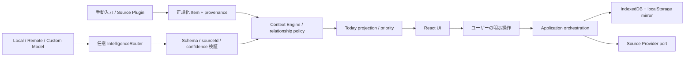

# Architecture

Domainは`src/domain/`、Applicationは`src/application/`とorchestration/sync、交換可能なSourceの型は`src/ports/`、実装は`src/adapters/`、Model契約とprivacy/routerは`src/intelligence/`。Node bridgeは`server/`にあります。外部SDKをDomainへ持ち込まず、AI出力はproposalとして決定的なContext方針とユーザー訂正へ渡します。モデルがstateや外部サービスを直接更新する経路はありません。

SOURCE/USER/DERIVEDのprovenanceを追跡し、source更新・ユーザー訂正・競合を区別します。オフライン中は保存済みデータを表示し、同期失敗で手動データを消しません。高影響操作はapplicationのrisk/confirmation判定を通します。Gmail/Calendarの実装は読み取りと接続解除で、メール送信や予定書込みを提供しません。

## 不変条件と検証箇所

| 条件                  | 根拠                                      |
| --------------------- | ----------------------------------------- |
| AIなしCore            | core/App test、zero-key E2E               |
| Contextの意味判断権限 | context-engine / relationship-policy test |
| modelは提案           | schemas、router、context-service test     |
| ユーザー確認          | orchestration、sample-action-safety E2E   |
| Provider交換          | provider/model contract test              |
| Plugin失敗の隔離      | source-plugin test、release regression    |
| SOURCE/USER/DERIVED   | projection / context-engine test          |
| remote privacy        | router privacy test、remote server test   |
| offline保存           | storageとoffline E2E                      |

同一プロセスのPluginにはOS権限を隔離するsandboxがありません。任意の拡張コードには信頼が必要です。
