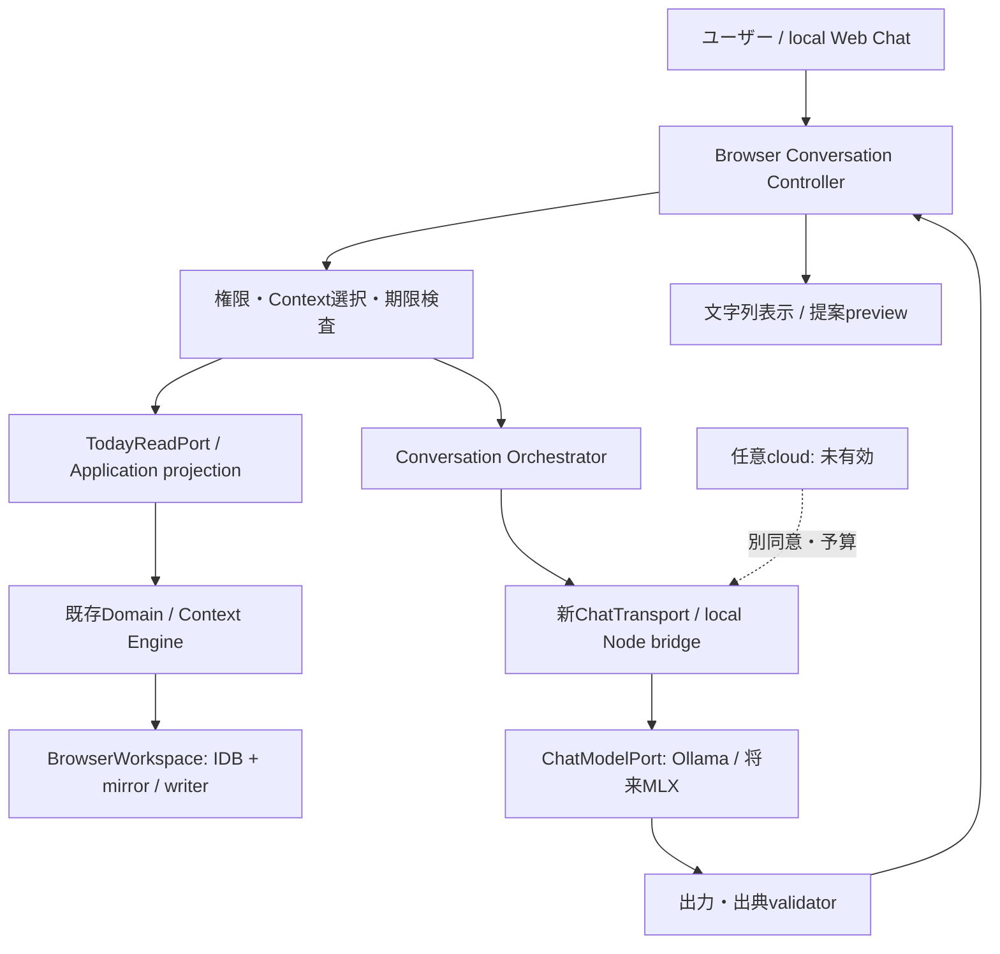
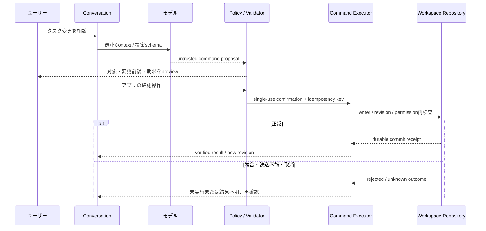
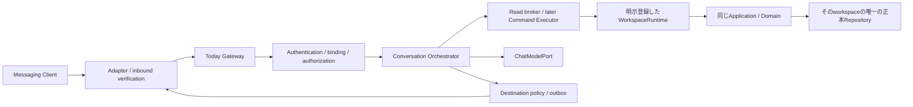

# Today V3 Architecture

## 2026-10-10: V2.1.0への移行

AI Chat・承認付きAI操作・Messaging共通基盤の正式開発対象を **Today V2.1.0** へ変更した。独立コピーで `2.1.0-alpha.1` の製品コードとMock/ローカル評価を実装した。具体的な実装状態は [V2.1実装記録](V2_1_IMPLEMENTATION.md)、[品質・残課題](V2_1_QUALIFICATION.md)を優先する。以下の元資料は2026-10-09時点の設計履歴として残す。「未実装/未承認/未実行」は元資料時点の記述であり、今回の結果を表す時はV2.1記録を参照する。

将来V3に残す範囲: GatewayWorkspace正本/永続ledger/常駐、実チャネルとiMessage、PWA実機・iOS・通知/共有、アカウント/同期/tenant/クラウド/商用。今回V2.0.3公開版・公式サイト・実アカウント・外部送信を変更していない。Qwenは未採用、iMessageは未対応、正式公開準備完了はNO。

---

区分: 未実装の推奨設計。基準identityと証拠は[Master Plan](TODAY_V3_MASTER_PLAN.md)。既存構成は[Architecture](ARCHITECTURE.md)を参照。

## 1. 継承する構成と新しい責務

| 層                            | 現在の場所                                                                             | V3での扱い                                                                     |
| ----------------------------- | -------------------------------------------------------------------------------------- | ------------------------------------------------------------------------------ |
| Domain                        | `src/domain/model.ts`, `context-engine.ts`, `relationship-policy.ts`                   | 決定的事実・Context・競合・provenanceを継承。Chat SDKを入れない                |
| Application                   | `src/application/today.ts`, `projection.ts`, `composition.ts`, `src/orchestration.ts`  | 読取りprojectionを再利用。全CRUDが現在Application port化されているとは言わない |
| UI/更新                       | `src/App.tsx`, `TodaySurface.tsx`, `PersistenceGate.tsx`, `public/sw.js`               | 手動Core・保存・更新動作を保持。Chatを任意panelとして追加候補                  |
| Storage                       | `src/storage.ts`, `scripts/storage-ownership.mjs`, `src/backup.ts`                     | browser正本、単一writer、revision、復旧状態を維持                              |
| Source                        | `src/ports/providers.ts`, `src/adapters/*`, `server/gmail.mjs`, `calendar.mjs`         | 読取りscopeを維持。メール送信・予定書込みを追加しない                          |
| Intelligence                  | `src/intelligence/*`, `server/local-model.mjs`, `ollama-model.mjs`, `remote-model.mjs` | 抽出機能を維持。privacyの分類は参照するがChat policyとは別version              |
| Conversation（新規）          | 候補`src/conversation/*`                                                               | 履歴、budget、context selection、turn制御、提案、read tool broker              |
| Command（後続新規）           | 候補`src/application/commands/*`                                                       | 決定的なmutation/認可/revision/commit結果。モデルから独立                      |
| Gateway/Messaging（後続新規） | 候補`server/chat/*`, `server/messaging/*`                                              | 外部principal、認証、ingress、inbox/outbox、tenant境界                         |

候補pathは作成していない。V2にはSource側IntelligenceProviderとモデル側IntelligenceProviderという異なる型がある。新ChatModelPortは別名で宣言し、構造化抽出能力と会話能力を混同しない。

## 2. Alpha: browserがデータの所有者

NodeはブラウザのIndexedDB/localStorageにアクセスできない。ブラウザが許可範囲のread-only snapshotを組み立て、Chat専用endpointへ渡す。serverはこのsnapshotを正本として保存せず、期限・サイズ・principal/session・workspace bindingを検査する。serverでモデルを呼ぶこととserverでCore DBを持つことを分ける。

初期Web Chatはlocal Nodeと同originで動作。HTTPS Pagesから利用者のHTTP loopbackへ直接アクセスするCORS/mixed-content/private-network回避を採用しない。公開静的CoreではChat unavailableを明示する。開発者Macへインターネットから接続しない。

### Snapshot contract（提案）

`WorkspaceSnapshot = {schemaVersion:1, workspaceId, snapshotId, persistenceRevision, generatedAt, expiresAt, localTime, timeZone, grants, records[], provenance[]}`。

- 値はbrowser/runtimeが生成し、モデルにworkspaceId/principal/permissionを選ばせない。
- 許可item ID・field projection・出典を添付。診断には本文を載せない。
- 変更、source refresh、同意撤回、writer引継ぎ、timezone変更でsnapshotを無効化。
- date検索はlocal calendar boundaryを決定的に計算。stale snapshotは新しい読取りを要求する。
- snapshotは参照用。AI提案を丸ごとstate置換へ変換しない。

## 3. Beta: 承認後の操作

現行App内のlocal state更新を、機能ごとに純粋なcommand handlerとUI adapterへ取り出す最小変更候補。Coreを一括リファクタリングしない。書込みの権威はwriter側で再検査し、V2のriskLevel<=1だからAIが即実行してよいとは判断しない。

## 4. Messagingが要求する別のデータ所有権

WorkspaceRuntimePortは`capabilities(), readSnapshot(scope), query(query, revision), propose(command), commit(confirmedCommand)`を持つ候補。各呼出しはprincipal/workspace bindingからscopeを決める。初期Messaging previewではreadSnapshot/queryのみ。

| 運転mode                         | 正本                                      | Web終了後          | 制限                                                               |
| -------------------------------- | ----------------------------------------- | ------------------ | ------------------------------------------------------------------ |
| BrowserWorkspace（現在・Alpha）  | そのoriginのIDB/mirror                    | ライブ読取り不可   | ページ・writerが必要。オフラインsnapshotを「現在の予定」と偽らない |
| Snapshot Messaging実験           | 利用者が公開範囲を選んだコピー            | 期限内の読取りのみ | 時刻・stale表示、期限切れ拒否、変更不可                            |
| GatewayWorkspace（別承認・後続） | 常駐Mac runtimeのtransactional repository | Mac稼働時に可能    | 所有権移行・schema・backup・writer・権限gate必須                   |
| CloudWorkspace / Sync（将来）    | 明示設計したtenant repository             | サービス稼働時     | tenancy、運用、コスト、sync、暗号化の独立gate                      |

**常駐Macからbrowser DBを覗く方式は採らない。** Web終了後の操作を実現するにはGatewayWorkspaceを用意する。選択肢はdesktop wrapperのrepositoryを共有するか、local serviceのrepositoryを正本としてWebはclientになる方式。初期推奨は後者を独立modeとして評価する。DB製品の選定・migration実装は未確定。

移行はバックアップ→source検証→新workspace生成→内容・revision照合→ユーザーの切替確認→旧workspaceをread-only保存。元のV2を自動削除しない。旧browser正本と新gateway正本を並行書込みさせない。どのdeviceがどのworkspaceを表示しているかUIに明示する。

Service Workerは常時起動serverではなく、browserデータを外部Messagingへ常時提供する代替にはならない。Macのスリープ・終了でGatewayが停止するなら応答不可として扱う。

## 5. ローカル・cloud交換とdeployment

- ChatModelPortはlocality、artifact/model revision、tokenizer、context限度、stream/cancel/structuredTool可否を宣言。実認可はPolicy/Executorに残す。
- 使用可能providerが無ければCoreへ戻る。cloud fallbackは都度の送信同意/予算検査が通った時だけ。抽出Routerの自動candidate列をそのままChatへ流用しない。
- 公開cloud Gatewayは既存loopback NodeをLAN bindする変更ではない。TLS、accounts、tenant repository、quota、監視、削除を新deploymentで満たす。
- 同期は別モジュール。V2のsource sync（Gmail/Calendar取得）をdevice syncと言わない。単なるrevision最大値で複数deviceの時計・競合を解決しない。

## 6. 互換性・障害

- V2 persisted state version3をAlphaでは変更しない。Chat履歴は独立store/keyで初期OFF、Core backupに暗黙混入しない。
- 現行backupはmanual itemsの追加。将来full workspace restoreは新format/capabilityとpreviewを要し、v2 backup importerを保持する。
- `UNAVAILABLE/CORRUPT`時はChat writeも停止。readは検証済みsnapshotに限りstaleを表示。
- model crash・cancel・容量不足・external service failureがCore保存を止めない。pending operationとwriterを無条件releaseしない。
- インメモリのgeneration無効化とbackend停止を別に確認。cancel後のlate resultをhistory/commandへ採用しない。

安全境界と障害gateは[Security](TODAY_V3_SECURITY_MODEL.md)、具体的契約は[Chat](TODAY_V3_AI_CHAT_SPEC.md)。

## 7. ブラウザ終了時のiMessage処理: 比較設計

追加設計、未実装。現行Node Gatewayから既存browser IndexedDB/localStorageを直接開かない。ブラウザprofileファイルの解析・Messages DBやユーザーの既存storageの探索も移行手段にしない。

| 方式                          | ブラウザ終了時             | 正本/単一writer                                              | 競合・復旧                                                              | 初期判断                                                    |
| ----------------------------- | -------------------------- | ------------------------------------------------------------ | ----------------------------------------------------------------------- | ----------------------------------------------------------- |
| active browserへのRuntime RPC | unavailable                | 既存browser writer                                           | 接続断でread中止、未settled writeをretryしない                          | Web Chatのみ。Web閉鎖要件は満たさない                       |
| 明示exportしたsnapshot        | 期限付きread-only可能      | 元browserが正本、コピーは参照専用                            | generatedAt/revision/TTL表示、再exportまで更新なし                      | Mock/個人実験の中間段階。現在データ・変更を保証しない       |
| GatewayWorkspace正本          | 常駐Mac稼働時に可能        | local serviceのtransactional repository、Web/Adapterはclient | expectedRevision/CAS・sole writer・command ledger、旧browserはread-only | **Web閉鎖を満たす初期の推奨候補**。migration/安全gateが必要 |
| browser↔Gateway双方向sync     | 最新同期した範囲に限り可能 | 各replicaがwriter、同期protocolが必須                        | operation ID/base version・競合・tombstone・切断時の整合性              | 単一writerを簡単に拡張できない。初期は延期                  |
| CloudWorkspace                | service稼働時に可能        | tenant別server正本                                           | tenancy/暗号化/key/運用/料金・offline sync                              | 無料継続・privacyの独立gate。V3初期の依存にしない           |

### 推奨する正本と互換性

GatewayWorkspace選択はworkspace単位で明示する。既存Pagesのbrowser workspaceはそのまま独立して使える。gatewayを起動しただけでデータを移したり、同じworkspace名だから同じデータと扱ったりしない。

local Node Web clientはGateway repositoryのprojectionを表示し、browser IDBを第二の可書込み正本にしない。IDBをcacheに使うならscope/revisionとread-onlyを明示する。既存Web Locksはbrowser tabの調整だけで、Node/file repositoryとのcross-process lockの代用にはならない。

`WorkspaceRepositoryPort`候補は`readConsistentSnapshot(scope)`, `commit(command, expectedRevision, operationId, confirmation)`, `lookupOperation(operationId)`, `health()`。データ更新・confirmation consume・idempotency ledger・revision増加を同じtransactionで成立させる。別threadのcommandが同revisionなら一方だけ成功、もう一方はconflict/repreview。scalar revisionは一つの正本でのみ意味を持つ。

storage製品・暗号化実装は未選定。read-only Mockではfictional in-memory repositoryでよいが、再起動耐性・一度だけeffectを保証する実運用gateにはtransactional persistenceが必要。memory Mapをdurableと呼ばない。

移行のgateは、ユーザー操作のexport → 完全な移行snapshotの範囲確認 → 新workspaceへimport → items/Context/corrections/cursor等のhashと意味を照合 → 旧writer停止 → 正本切替確認。現行manual-additive backupだけで全workspace移行できるとは仮定しない。未対応fieldがある場合は停止/明示除外の別承認。旧保存を削除せず、失敗時は切替前の旧workspaceへ戻す。

### 常駐処理・鮮度・UI不在

GatewayはBridge/Adapter、conversation policy、bounded Chat runtime、repository、inbox/outboxを持つ独立process構成候補。Mac sleep/offline時は常時応答を保証しない。再起動時に設定/identity/watermark/expiry/pending outcomeを検査し、古い受信を一括処理しない。

「今日/明日の最新予定」にはlive consistent snapshotを要求し、reply送信直前にrevisionとgrantを確認する。変更なら一度だけ再構築し、再変化なら再質問へ。snapshot modeでは「最終更新…のコピー」と表示し、期限切れで最新と装わない。

手動返信でToday UIを閉じている時はdraftを期限付きで保留し、送信しない。限定autoは事前grantとRuntimeが有効な時だけUIなしで返信可能。操作確認modeはMessaging/Securityのsingle-use確認を通す。ただしhigh-impact/認証不足はUI再認証待ちとなり、画面を閉じていることを承認省略の理由にしない。

モデル停止中もCore repositoryと手動操作は維持する。Bridge故障で正本をempty stateにせず、Chat停止とworkspace障害を別のhealth状態で表示する。
