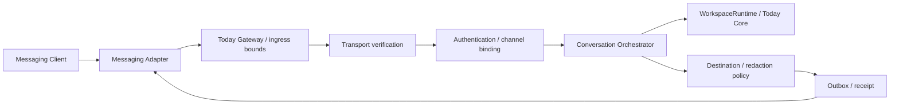
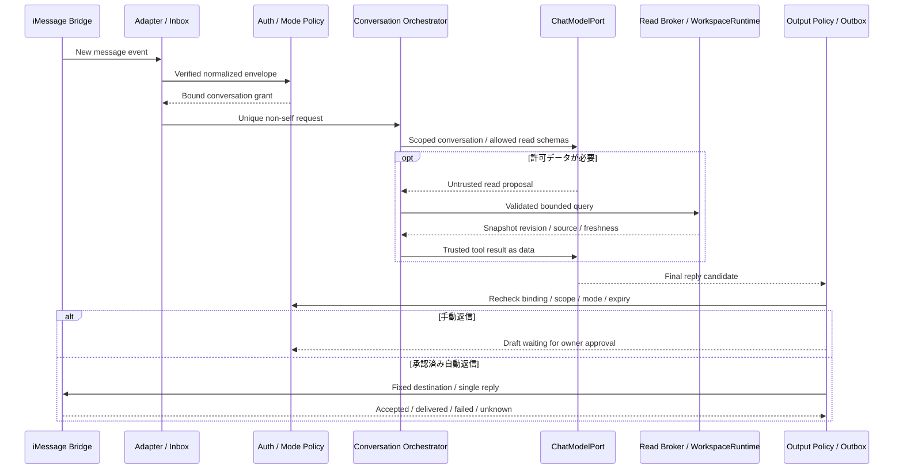

# Today V3 Messaging specification

## 2026-10-10: V2.1.0への移行

AI Chat・承認付きAI操作・Messaging共通基盤の正式開発対象を **Today V2.1.0** へ変更した。独立コピーで `2.1.0-alpha.1` の製品コードとMock/ローカル評価を実装した。具体的な実装状態は [V2.1実装記録](V2_1_IMPLEMENTATION.md)、[品質・残課題](V2_1_QUALIFICATION.md)を優先する。以下の元資料は2026-10-09時点の設計履歴として残す。「未実装/未承認/未実行」は元資料時点の記述であり、今回の結果を表す時はV2.1記録を参照する。

将来V3に残す範囲: GatewayWorkspace正本/永続ledger/常駐、実チャネルとiMessage、PWA実機・iOS・通知/共有、アカウント/同期/tenant/クラウド/商用。今回V2.0.3公開版・公式サイト・実アカウント・外部送信を変更していない。Qwenは未採用、iMessageは未対応、正式公開準備完了はNO。

---

区分: 未実装。今回サービスへの送信・Bridge導入・アカウント変更はしていない。共通構成は[Architecture](TODAY_V3_ARCHITECTURE.md)、認証と同意は[Security](TODAY_V3_SECURITY_MODEL.md)。調査日2026-10-09。

## 1. 提供順と到達条件

1. Today local Web Chatで会話・read-only権限・取消・Contextを固定。
2. 共通Messaging Adapterをfake transportで検証。
3. 公式APIの1チャネルを専用テスト環境で評価。無料・private chat中心のTelegramを優先候補とする。
4. iMessageは独立した個人実験。規約・OS実機・権限のgateを満たすまで実送受信へ進まない。

「Today Webを閉じても最新データを扱う」は、常駐GatewayWorkspaceの正本repository・所有権移行・単一writerが完成して初めて成立する。現在のbrowser保存をMac Bridgeが読めると仮定しない。期限付きsnapshot実験は古さを表示し、変更を禁止する。同期やCloudWorkspaceがなければ、別deviceで同じ状態は保証できない。

## 2. 共通契約

`MessagingAdapter`候補: `verifyInbound(raw, headers)`, `normalize(verifiedEvent)`, `capabilities()`, `acknowledge(event)`, `send(authorizedReply)`, `lookupDelivery(replyId)`。副作用のあるsendにはGateway生成のdestination grantだけを渡す。モデルからaddress/宛先変更を受け付けない。

正規化event: `{contractVersion:1, channel, adapterInstanceId, providerEventId, messageId, threadId, providerSenderId, recipientBindingId, direction, sentAt, receivedAt, kind, content, replyTo, attachmentMetadata}`。

- 送信者IDはtransportが検証したplatform識別子で、表示名や本文の自己紹介ではない。
- direction/fromSelfは検証済みsourceから設定し、文字列だけで自己メッセージと認定しない。
- 初期はtext-only、1対1の登録threadのみ。添付・group・転送・音声・botからの入力は拒否またはmetadataのみ。
- body64KiB、text4000文字、原文保持は初期OFF、処理済みID10000件/7日を初期上限案とする。境界は生bytes段階で検査する。
- platform特有のreply token・bot tokenはAdapter内部だけ。Chat/history/diagnosticへ出さない。

## 3. 本人とworkspaceの対応

trusted Today UIでchannel linkingを開始し、短期限・single-useのchallengeを一つの検証済みprivate conversationで応答し、Today側で表示されたchannel/principal/workspaceを本人が確認する二段階の候補。username/電話番号の一致だけではlinkを成立させない。

bindingは`(tenant, workspace, channel, adapterInstanceId, immutable providerSenderId, recipient account, permitted thread)`に結び付ける。未知sender、group化、participant変更、recipient変更、アカウント失効時は停止し、UIで再確認。外部チャネルからlink開始やadmin grant追加を許可しない。

チャネル側アカウント乗っ取りは別リスク。初期はschedule/taskの限定readのみ、メール本文・秘密・大量exportは禁止。最初の変更確認はToday UIへ戻し、後続の操作確認モードは本書§8とSecurityの追加gateを満たす場合だけメッセージ上で確認する。第三者へ届いたメッセージは回収不能になり得るので、Todayデータをそのサービスへ返す同意をmodel送信同意から分ける。

## 4. 配達・重複・エコー・再送

| 条件                     | 必須動作                                                                             |
| ------------------------ | ------------------------------------------------------------------------------------ |
| 同じprovider event再配達 | channel/adapter/event IDのdedupを永続inboxへ記録し同じturnへjoin                     |
| 同文だが異なるmessage ID | 同一内容という理由だけで破棄しない。別要求として認可・rate検査                       |
| Gateway replyを受信      | fromSelf、outbound provider ID、origin turn IDからloopを止める                       |
| Webhook遅延/順序入替     | sender時刻は参考。server受信順で会話を直列化、古い変更要求を拒否                     |
| Offline/スリープ         | durable queue導入済みの場合だけ受付。初期TTL5分、期限切れは現在状態で再質問          |
| ACK期限                  | platformに合わせ早期ACK/defer、model完了を待たない。認証・保存前に受付済みと偽らない |
| 429/一時エラー           | Retry-Afterと上限付きbackoff。queue/予算/期限を超えたら止める                        |
| 宛先変更/失効/同意撤回   | outboxも再検査しキャンセル、既存provider reply tokenに依存して継続しない             |
| send timeout/配達不明    | UNKNOWN_DELIVERYを保存。成功表示・無条件再送をしない                                 |
| 改ざん/巨大body/未認証   | modelを起動する前に拒否。型付き原因だけ記録                                          |

inbox状態: RECEIVED → VERIFIED → BOUND → ACCEPTED → PROCESSING → COMPLETED / REJECTED / EXPIRED。

outbox状態: PLANNED → DESTINATION_VERIFIED → READY → SENDING → DELIVERED / FAILED / UNKNOWN_DELIVERY。

networkのexactly-onceを保証しない。local effectはidempotency key + transactional command ledgerで一度だけにする。外部sendが不明なら照会可能なprovider receiptを使い、照会不可では再送をユーザー判断にする。返信のretryでCore mutationを繰り返さない。

## 5. iMessage / BlueBubblesの実現性

Appleの[Messages framework](https://developer.apple.com/documentation/messages)と[iMessage Apps](https://developer.apple.com/imessage/)はextensions等の資料であり、一般Botの任意送受信server APIを確認した証拠ではない。Appleの一般向け公式Bot APIがある前提を置かない。Messages for Business等も個人Bridgeの無条件代替とは扱わない。

BlueBubblesの[server資料](https://docs.bluebubbles.app/server)はMessages DBのpolling・AppleScript・macOS依存を説明し、[REST/Webhooks](https://docs.bluebubbles.app/server/developer-guides/rest-api-and-webhooks)を公開する。基本送受信と[Private API](https://docs.bluebubbles.app/private-api/installation)は別。後者はSIP無効化を要求するため対象外。OS security回避、helper注入、VM hardware spoofingを手順にしない。

| 事項       | 確認とgate                                                                                                                                                                                                             |
| ---------- | ---------------------------------------------------------------------------------------------------------------------------------------------------------------------------------------------------------------------- |
| 環境       | MessagesでiMessageが利用できるMac。M5/macOS27.2での実動作は未検証。一般的な「Sierra以降」をこの新OSの保証にしない                                                                                                      |
| 常駐       | Mac稼働・Messages・ネットワークが必要。スリープ/再起動/Apple認証失効を試験する                                                                                                                                         |
| 権限       | [installation](https://bluebubbles.app/install/)と[FAQ](https://bluebubbles.app/faq/)はMessages DB読取りにFull Disk Accessを要求。Todayの狭いsandboxと同等ではない。専用OS user/試験Apple Account等の分離をOwnerが判断 |
| 通信       | REST/Webhook。通常案内はTLS/proxy/Firebaseを含む。通知・tunnelを無条件有効にしない。初期実験は外部公開せずlocal connectorから開始                                                                                      |
| credential | RESTのpasswordがquery parameterに入る方式はURL/log漏洩リスク。Adapter専用secret管理、URL全面redaction、proxy/access log・referer経路をレビュー                                                                         |
| sender     | webhookが届いたことだけでは本人認定不可。登録recipient/thread/senderを認可、必要なら認証済みRESTでeventを再取得。webhook署名能力は今回未確認                                                                           |
| group/self | 自分の同一accountへの送信でbot成立すると仮定しない。専用相手・fromSelf/ID・既存1対1threadを試験。groupは初期非対応                                                                                                     |
| 機能       | Private API依存の返信/反応/group管理/削除を必要条件にしない。plain-text応答だけを候補にする                                                                                                                            |

### License / 利用規約の保留条件

2026-10-09に確認したGitHub最新正式Release APIはv1.9.9。[root LICENSE](https://github.com/BlueBubblesApp/bluebubbles-server/blob/master/LICENSE)はApache-2.0。一方、現在の[規約](https://bluebubbles.app/tos.html)はServer1.xとSwift Server2.xのlicenseを分け、後者にPolyForm Small Business＋個人利用追加許可を記載する。**全BlueBubblesをApache/MITと一括認定しない**。採用release・artifact・含まれるdirectoryのlicenseを固定する。今回Swift directoryのLICENSE候補URLは取得できず、実配布物の検証は未了。

同規約には自動アクセスに関する制限もあり、REST提供と計画するBot利用の適用関係は未確定。Apple/第三者proxy/Firebaseの規約・[privacy](https://bluebubbles.app/privacy.html)・地域条件も確認が必要。ライセンス上のコード利用とサービス規約上の許可を混同しない。商用提供・教育/未成年の利用を認めたとは判断せず、必要ならOwnerの法的判断/提供者確認後に進む。今回問い合わせ送信はしていない。

**結論:** SIPを維持した基本Bridgeは技術実験候補だが、Todayとしての送受信・本人認証・規約適合は未証明。V3正式公開の依存条件にしない。

## 6. 公式チャネルとモバイル経路の比較

| 候補                   | 技術/認証                                                                    | 無料優先・適合                                                                                               | 判断                            |
| ---------------------- | ---------------------------------------------------------------------------- | ------------------------------------------------------------------------------------------------------------ | ------------------------------- |
| Today Web Chat         | 同origin session + 明示scope                                                 | 既存local runtime、追加外部輸送なし                                                                          | 最優先                          |
| PWA / mobile Web       | browser Core、Web Chat modeに従う                                            | 新契約不要で開始可能。Pagesだけではserverなし                                                                | 並行改善候補                    |
| Telegram Bot API       | long pollingまたはHTTPS webhook、secret_token、private sender/thread binding | Mac outbound pollingなら公開ingress不要。paid broadcastはfalse、rate/quotaで停止。platformへ返信データが渡る | 公式APIの第一比較候補           |
| Discord interactions   | signature/timestamp、command-driven interaction                              | 明示commandで始めやすい。公開HTTPS endpoint/接続経路と運用が必要なmodeあり。channel/group誤送信に注意        | developer/community向け第二候補 |
| LINE Messaging API     | HMAC webhook signature、user binding                                         | replyはquota count対象外、push等はplan枠対象。日本語利用者向けだがHTTPS ingress・region/plan検査必要         | 需要と無料枠で比較              |
| iOS App                | Today認証、App Intents/共有シート等                                          | 開発・配布・通知能力を区別。App Store費用は別判断                                                            | PWA検証後                       |
| Notification           | browser/native権限、clickでTodayへ                                           | push backend・iOSの条件・OS抑制がある。通知本文初期は非機密                                                  | 補助機能、常時botではない       |
| Shortcut / Share sheet | ユーザーが開始した入力、確認UIへ渡す                                         | 任意のブラウザDBを背景取得する能力とは別。誤共有にpreview                                                    | low-risk capture候補            |

一次資料: [Telegram API](https://core.telegram.org/bots/api)、[Bot FAQ](https://core.telegram.org/bots/faq)、[Discord interactions](https://docs.discord.com/developers/interactions/overview)、[LINE overview](https://developers.line.biz/en/docs/messaging-api/overview/)、[署名](https://developers.line.biz/en/docs/messaging-api/verify-webhook-signature/)、[料金](https://developers.line.biz/en/docs/messaging-api/pricing/)。料金・上限・アカウント規約は導入時に再取得し、0円で運用できない方式は延期する。ここで登録/送信はしていない。

## 7. Preview必須試験（未実施）

fake transportでwrong sender/workspace/thread、invalid signature/replay、duplicate・echo・順序入替、TTL・restart・sleep・queue満杯・cancel、recipient変更、read grant撤回、UNKNOWN_DELIVERYを固定fixtureとして試験。越権出力0、無承認変更0、local effect duplicate0を必須gateにする。

実チャネルはOwnerが承認した架空データ・専用conversationで1対1から開始。無関係のMessages履歴やGmailを収集しない。Webが閉じた場合の現在データ確認はGatewayWorkspace完成後の別試験。iMessage不合格ならAdapterを無効のまま残し、Core/Chatのreleaseを阻害しない。

## 8. iMessage受信・推論・返信の詳細設計（追加指示）

2026-10-09追加。**未実装・実送受信未承認**。初期設定は手動返信。事前承認済み本人の会話への限定的な自動返信と、後続のメッセージ上での操作確認を区別する。既存の「初期はUI確認」は最初の安全段階として維持し、メッセージ確認は追加gateで許可する。

### 8.1 専用受信先とbinding

Today AI専用の受信先を用い、Ownerの通常のMessages全体を受信対象にしない。Apple Account/受信handleの選定・作成はOwnerの別判断。既存1対1threadの相手、Bridge instance、recipient account、workspaceをtrusted Today UIで登録する。同じApple Accountの自己会話で正常なBot入出力を作れるとは仮定しない。

iMessageの電話番号・email handle・Bridge内IDは表示名より確かな対応情報になり得るが、本人の暗号学的認証や永久不変の人物IDではない。UIでの登録とchannel challenge、検証済みBridge接続、sender/thread/recipientの複合bindingをすべて要求する。handle再割当、Apple Account変更、thread参加者変更、Bridge再設定でbindingを無効化する。確認できないBridge eventは拒否し、autoを有効にしない。

未登録senderにはToday本文も推論結果も返さず、初期は無応答。エラー説明を返すとしてもworkspace存在や予定を明かさない別承認の固定文のみ。連絡先一覧や無関係threadを履歴へ取り込まない。

### 8.2 10段階の処理契約

| 段階           | 処理・責任者                                        | 検査・失敗時                                                                                                            |
| -------------- | --------------------------------------------------- | ----------------------------------------------------------------------------------------------------------------------- |
| 1 検出         | Bridgeがnew-messageを検出                           | 更新/既読/typing/自己イベントを新要求にしない。webhookは検出hintで、真正性が不足する場合は認証済みRESTからeventを再確認 |
| 2 正規化       | AdapterがMessageEnvelopeへ変換                      | bytes、kind、ID、時刻、recipient、directionを検証。未知構造・添付・groupは初期拒否                                      |
| 3 認可         | Gatewayがbinding/grant/modeを評価                   | 検証済みsender/thread/受信先/workspace、期限、mode policy version。認可前にToday読取り・モデル起動をしない              |
| 4 除外         | durable inboxでduplicate/fromSelf/echo確認          | provider IDとoutbound IDを照合。hash一致だけで正当な同文要求を消さない。起動前の古い履歴を一括処理しない                |
| 5 会話構築     | Orchestratorがconversationと予算を固定              | 会話キーはbinding+workspace+thread。Context本文はまだ取得せず、許可capabilityと時刻を渡す                               |
| 6 理解         | ChatModelPortが内容/読取り提案を生成                | system/外部本文を分離。modelの宛先・権限・mode変更要求は不採用。Qwen3.5-4Bは候補                                        |
| 7 必要な読取り | Read brokerがschema/grant/範囲を検査しRuntimeへ照会 | 雑談は0 read。最大2 read calls。stale/曖昧/未許可は質問または固定エラーへ。DBへモデルを接続しない                       |
| 8 返答案検証   | 出典/個人情報/サイズ/宛先policyを検査               | scope外・未確認の実行主張・不正link・truncatedなら送信しない。validatorの判定をLLMだけに委ねない                        |
| 9 送信判断     | 手動ならUI承認、autoなら事前grant＋send直前再検査   | 宛先はbindingから決定。生成途中のdeltaを送信しない。署名/ID/認可不足ならdraft止まり                                     |
| 10 結果管理    | outboxがBridge receipt/失敗/不明を保存              | acceptedとdeliveredを区別。確実な送信前失敗だけbounded retry、UNKNOWNは無条件再送しない                                 |

### 8.3 三つの動作モード

| Mode                       | 自然会話・安全な照会                                                | Today変更                                         | 送信条件                                                                |
| -------------------------- | ------------------------------------------------------------------- | ------------------------------------------------- | ----------------------------------------------------------------------- |
| MANUAL_REPLY（既定）       | 認証済み要求からdraft生成                                           | 実行なし                                          | Today UIで本文と宛先を承認。未承認draft15分で失効                       |
| AUTO_REPLY_READ_ONLY       | 登録本人1対1threadで、許可した通常会話と限定task/schedule照会に返信 | 実行なし。追加/変更要求には未実行と説明           | 事前grant、毎回の認可/出力/送信先検査。メール本文・秘密・大量exportなし |
| CONFIRM_OPERATIONS（後続） | UIで選んだ返信policyを継承                                          | allowlistのlocal task/eventのみ、下記の専用確認後 | preview送信と確認受付を別scopeで有効化。結果はdurable commit後のみ返信  |

`ConversationPolicy`はmode、replyPolicy、bindingId、workspaceId、read scopes/field allowlist、operation allowlist、maxTurns/rate、expiresAt、policyVersionを持つ。選択はtrusted Today UIだけで行う。「自動返信にして」という受信本文では設定変更しない。

初期はMANUAL_REPLY。autoには通常会話/予定の返答がiMessage外部通信になることを示して明示ONを求める。初期auto sessionの有効期間は24時間候補で、期限延長はUIで行う。再起動はinbox watermarkを復元し、binding/同意/期限を再検査する。検査不能・時計不整合・session失効時は手動へ戻す。返信停止のlocal UIは常設する。登録channelの固定`停止`commandは決定的にautoをOFFにできるが、再有効化はUIだけ。

制限案: 一受信要求に最大1つの最終返信（操作preview/結果は別の認証済み確認イベントに対応）。bindingごと5返信/分・30/時・100/日、生成同時1。上限時に毎回警告を送り続けず、outboxを止めてUIに表示。rate/dedup状態の永続化失敗はfail closed。

### 8.4 メッセージ上の操作確認

これは後続の独立安全gate。初期Mockは可逆なlocal taskの新規登録/タイトル・期限変更だけ。Gmail送信/削除、Google Calendar外部変更、任意code、権限変更は含めない。

1. モデル提案を決定的なhandlerで正規化し、対象・変更前後・年月日/timezoneを解決。同名/曖昧ならpreview前に質問。
2. Executorが`PendingConfirmation`を生成。proposalHash、principal/binding/thread/recipient/workspace、expectedRevision、operation、policyVersion、single-use nonce、expiresAtに結び付ける。
3. trusted templateで対象・差分・未実行・期限・取消手段と確認challengeを表示。challengeはGatewayが生成しモデルに生成させない。同threadで同時pending1件、120秒TTL候補。
4. 本人が`確認 <challenge>`または`取消 <challenge>`を新しいメッセージとして返信。完全一致の専用parserで扱い、LLMに可否判断させない。「はい」、引用/転送/古いchallenge、別thread/senderは承認にしない。
5. preview送信の受理/配達状態を確認できない場合はconfirmationを受理しない。確認イベントの真正性、期限、nonce、permission、current revision、writerを実行直前に再検査。変化なら新previewが必要。
6. durable command ledgerとeffectを同じtransactionでcommitし、結果を再読取り。duplicate確認/restart/並列イベントでも一度だけ効果を適用。
7. 保存結果のreceiptを固定宛先へ返信。結果返信が失敗しても再度Core操作しない。commit不明なら状態照会/照合へ進み自動再実行しない。

nonceは当該operation用challengeであり、password/2FA/tokenを会話へ送らせる方式ではない。ただしchannelを乗っ取られた場合、この確認だけで本人性は証明できない。影響が大きい操作や本人性不足はToday UIの再認証へ戻す。grantが無ければconfirmation messageを生成・送信しない。

### 8.5 失敗・情報出力

model unavailable/timeout/cancel/不正出力は、manualではUIへ失敗を表示してdraftを送らない。autoでは認証済みthreadだけに「現在AIを利用できません。変更は行っていません」等の固定文を最大1回。変更中の結果不明にこの文を使わず、操作IDと状態確認案内へ切り替える。外部cloudへのfallbackはしない。

同意した最小情報はtitle/date/status等を固定templateで返す経路も候補。自由生成文がsource allowlistの機密漏洩検査に通ることを証明できない場合、機密照会のautoはこの定型表示へ縮小する。モデルによる自己検閲を最後の認可境界にしない。

Bridgeの実send API、sender eventの真正性・内部ID、receipt照会・thread挙動・macOS27.2互換・規約適合は未検証。今回一次資料のREST/Webhooks・SIP条件・規約を再参照したが、実接続やBot許可を確認したわけではない。
