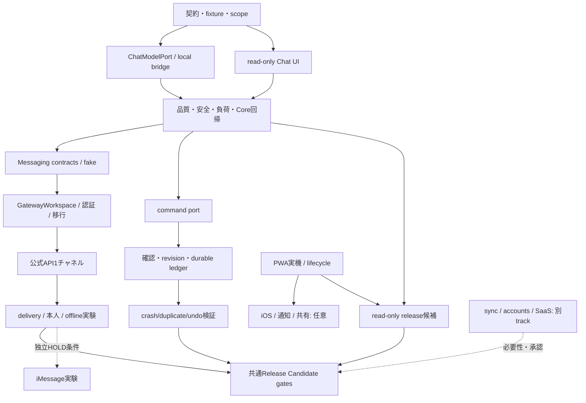

# Today V3 Roadmap

## 2026-10-10: V2.1.0への移行

AI Chat・承認付きAI操作・Messaging共通基盤の正式開発対象を **Today V2.1.0** へ変更した。独立コピーで `2.1.0-alpha.1` の製品コードとMock/ローカル評価を実装した。具体的な実装状態は [V2.1実装記録](V2_1_IMPLEMENTATION.md)、[品質・残課題](V2_1_QUALIFICATION.md)を優先する。以下の元資料は2026-10-09時点の設計履歴として残す。「未実装/未承認/未実行」は元資料時点の記述であり、今回の結果を表す時はV2.1記録を参照する。

将来V3に残す範囲: GatewayWorkspace正本/永続ledger/常駐、実チャネルとiMessage、PWA実機・iOS・通知/共有、アカウント/同期/tenant/クラウド/商用。今回V2.0.3公開版・公式サイト・実アカウント・外部送信を変更していない。Qwenは未採用、iMessageは未対応、正式公開準備完了はNO。

---

区分: 推奨順序・概算。バージョン/日程/採用modelは未確定。詳細契約は[Master Plan](TODAY_V3_MASTER_PLAN.md)から参照。コード作成・公開は今回未承認。

## 1. 計画の変更提案

ユーザー案のChat → 承認付き操作 → Messaging → mobileを維持する。ただし**Messaging前にWorkspace所有権と認証gate**を追加する。PWA実機品質はChatと並行して着手候補。sync/SaaS/課金/iMessageは別trackにし、read-only Chatの正式公開を待たせない。

`V3.0 Alpha`等は作業名として使う。V3.0をread-only Chatの安定公開にするか、Betaまで含むかは品質/実測/利用者需要から決める。小数versionを機能契約として確定しない。

## 2. 見積りの前提

1人日=集中実装/検証約6〜8時間の概算。1人の実装者、既存Core再利用、レビュー協力を想定。仕様解釈・失敗調査・実機検証を含む幅で、並列化すれば単純に日数が縮む保証はない。Owner認証・規約回答・新hardware・公開審査の待ち時間は含まない。新API費用・外部サービス契約の承認も見積りと分離する。

| Stage / 作業名         | 作業                                                                          | 見積り     | 依存/難易度                            | 完了基準                                                                |
| ---------------------- | ----------------------------------------------------------------------------- | ---------- | -------------------------------------- | ----------------------------------------------------------------------- |
| A0 / Alpha準備         | G01/G02契約、fake model、架空snapshot、fixture/rubric固定                     | 2〜3人日   | 低〜中、設計承認後                     | 不正role/scope/日時/サイズを拒否するcontract tests、source identity固定 |
| A1 / Chat UI           | optional panel、下書き/IME、history memory-only、read-only projection、a11y   | 4〜6       | A0、中                                 | 4画面とCore保存維持、AI OFFでno inference、引用/unknown/取消を表示      |
| A2 / Local model       | 新Chat port/Ollama adapter、budget/deadline/concurrency/cancel/停止           | 4〜6       | A0、中〜高                             | existing bridge維持、runtime stopを実証、cloud fallbackなし             |
| A3 / Alpha評価         | 固定model評価、安全fixture、Core共存、Mac/CI/browser回帰                      | 5〜8       | A1/A2、高                              | Chat仕様の事前基準・有限安全fixture・負荷・実機gate、全失敗receipt      |
| B0 / Beta準備          | 必要なlocal操作だけcommand port化                                             | 4〜6       | A3、中                                 | 既存create/update/complete等のmanual動作とundo一致                      |
| B1 / 承認write         | trusted preview、single-use confirmation、revision/idempotency/durable ledger | 7〜12      | B0、高                                 | 全Chat変更に確認、grant再検査、duplicate/crashで二重効果なし            |
| B2 / Beta評価          | 誤対象/曖昧日時/取消/失敗/再起動/undo・regression                             | 5〜8       | B1、高                                 | actual saved result確認、unknown outcomeを成功と偽らない                |
| M0 / Adapter共通       | fake ingress/binding/inbox/outbox/dedup/TTL/echo                              | 4〜6       | A3、中                                 | transport負例・destination固定・replay/echo防止                         |
| M1 / Workspace Runtime | 正本repository、explicit移行、認証、常駐read-only runtime                     | 8〜15      | M0、高                                 | Web閉鎖後に正本読取り、sole writer、旧V2互換/backup、sleep停止表示      |
| M2 / 公式API Preview   | Telegram1対1を第一候補に実検証                                                | 4〜7       | M1＋別送信承認、中                     | dedicated channel link、read-only reply、無料上限停止、secret非漏洩     |
| M3 / 配達実機          | sleep/restart/delay/order/revoke/unknown delivery、プライバシー               | 5〜8       | M2、高                                 | forged/第三者/別thread出力0、retryでmutationなし                        |
| IM / iMessage実験      | exact release/license/terms/OS、basic Bridge・本人binding                     | 5〜12以上  | M0/M1＋Ownerの規約/権限判断、高/不確実 | SIP維持、Private APIなし、専用conversationのみ。未成立なら延期          |
| P / Multi-device前段   | PWA実機install/offline/lifecycle、mobile a11y、共有導線計画                   | 10〜17     | 既存Coreから並行、中〜高               | 実iPhone/Android証跡、保存/更新/復旧、通知は別gate                      |
| I / iOS任意            | native shell、App Intents、共有、通知の専用検証                               | 15〜30以上 | P・deployment選択・費用判断、高        | auth/権限/オフライン・実device。syncなしの境界明示                      |
| S / Sync/SaaS任意      | accounts/tenant/key/競合/削除/運用/料金設計と実装                             | 30〜60以上 | M1、需要・費用・法務判断、非常に高     | tenancy/復旧/多device競合/cost guard。具体的構成前は粗い幅のみ          |
| RC / 共通正式公開      | security/a11y/互換/全CI/source archive/public smoke/配布照合                  | 8〜15      | 公開するstageのみ、高                  | 新commit/tree/hashに全必須receipt、owner公開許可、未解決重大blocker0    |

Alphaは計15〜23人日、Beta追加16〜26人日、公式Messaging追加21〜36人日の概算。iMessage・iOS・sync・RCは含めない。これは実装工数で、正式な納期や無料サービス稼働保証ではない。新backend/保存移行が難航する場合はMessagingをsnapshot read-onlyへ縮小するか延期する。

## 3. 各段階のGo / No-Go

### A: AI Chat基盤

Go: 専用契約・source scope・安全な文字列表示・履歴OFF・cancel/deadline/queue・AIなしCoreが実証され、架空ケースでquality基準を満たす。model比較が未了なら「暫定対応model」と表示し、最適性を宣伝しない。

No-Go: unauthorized Context、model出力の直接実行、silent cloud fallback、メモリによるCore停止、cancel後の回答採用。該当箇所を修正または機能縮小する。

### B: 承認付き自然言語操作

Go: local manual tasks/eventsに限定し、proposal preview/対象確定/revision/承認/ledger/結果確認/undoが成立。既存Providerへ外部writeは入れない。

No-Go: transactionとledgerのatomicity未証明、writer競合、承認なし新規登録、old revision適用、unknown commitの自動retry。read-only版を維持する。

### M: Messaging Preview

Go: 正本Runtime・authenticated binding・1対1scope・durable inbox/outbox・dedup/echo/期限・送信同意・free-tier stopが成立。read-onlyから開始。

No-Go: browser終了後にsourceが無いのに現在予定を回答、localNodeのLAN公開だけで認証代替、規約未確定/SIP無効化依存、別senderへの出力、未知配達の無条件再送。iMessageは独立HOLD可能。

### P/I/S: モバイル・同期・商用化

PWAの実機品質を先に測る。notification/App Store/device syncは別acceptanceで、全部そろうまでChatを公開できないという条件を置かない。無料が維持できない任意機能は導入せず報告。MIT既存権利を遡って制限しない。

## 4. 最初の実装承認単位

最初に提案するのは**A0+A1のread-only Chat vertical slice**。候補変更: 新`src/conversation/*`/Chat UI、`App.tsx`への任意入口、Application read adapter、fake Chat transport/test。製品の既存抽出bridge、Google権限、保存version、公開Pagesは変更しない。

理由: 今日/明日の予定検索を出典付きで答える最小体験で、構造化抽出契約との分離とprivacyを先に確かめられる。risk: UI focus/IME・Context漏洩・Core保存の干渉。試験: fake model契約、選択scope・日付境界・キャンセル・text rendering、既存Core/V2/storage regression。

別承認が必要なA2: 新Chat backendと既存ローカルmodel評価。新model download・training・paid API・実Provider dataを含めない。benchmarkを増やす際にも機種負荷・停止条件を先に固定する。

G05以降のwrite・Gateway migration・外部Messaging送信・OAuth scope追加・iOS配布/課金・公開は、それぞれ具体的diff/範囲・risk・testを提示した後に承認する。今回の設計指示をこれらの実行許可へ拡大しない。

## 5. Release Candidate運用

新identityにV2全回帰と公開するV3機能gateを加える。Node22/24、Mac/Ubuntu、Firefox/WebKit、実mobile、accessibility、backup/migration、security/privacy、dependency/license/SBOM、source/archive、匿名start、公的配信identityを照合する。使わないチャネルの未検証を対応済みと記載しない。

required CIにChat/command/authの決定的安全suiteを追加候補とし、auth/storage変更は独立reviewを推奨。大きなモデル推論は標準CIの自動downloadにせず、承認済み実機receiptを別gateにする。public runner/free-tierの制限、artifact保持期限、予算stopを再確認する。

失敗は元ログ・artifactを残し最小修正・targeted・regression・new qualification。旧Releaseの成功を変更後のsourceへ無条件流用しない。正式tag/Release/Pages更新は別許可後。未解決のデータ喪失・越権・機密漏洩・license・source identity問題があればHOLD。

## 6. 意思決定・未確認

採用modelは比較評価後。公式チャネルは需要と無料上限から1つを選ぶ。GatewayWorkspaceのrepository・migration方式、syncの必要性、iOS配布費用、iMessage規約適用は未決。A0/A1はこれらを前提にせず開始できる。

工数を更新する時は完成率で曖昧にせず、fixture/実機/CI/identityの未完了gateを列挙する。最終的なV3 release番号とscopeはread-only/承認write/Messagingを個別にreleaseできる設計を基に判断する。

## 7. iMessage受信→AI推論→返信の段階別検証計画

追加設計、**以下は未実行**。今回製品code、Mock検証code、モデル起動、Bridge接続/送信を実装しない。iMessageを独立実験とする方針を保ち、Mockからmodeを順に検証する。

| Step | 対象/環境                                                                 | 工数追加目安            | 次段階へのgate                                                                                                   |
| ---- | ------------------------------------------------------------------------- | ----------------------- | ---------------------------------------------------------------------------------------------------------------- |
| IM0  | 架空event + fake ChatModelPort + fake repository + Mock outbox、手動draft | 2〜3人日                | 不正sender拒否、draftのみ、承認前send0、Context最小化、全イベントreceipt                                         |
| IM1  | 同じMockでopt-in auto read-only                                           | 2〜4                    | 明示mode/grant、通常会話read0、許可queryだけ、固定宛先、echo/dedup/rate/TTL                                      |
| IM2  | Mockでlocal taskのmessage confirmation                                    | 3〜5                    | trusted preview・one-time challenge・revision・atomic ledger、duplicate/restart/revokeでeffect増加0              |
| IM3  | 別承認後、既存候補local LLM＋fictional workspace＋Mock transport          | 2〜4                    | 自然な日本語/多turn/日時、typed read proposal、失敗、出典、Core共存。real model品質とfake pipeline安全性を別計測 |
| IM4  | GatewayWorkspaceの正本/移行・常駐/再起動、Browser閉鎖                     | M1枠で評価              | 唯一writer、全データ互換、旧保存保持、closed browser live query、offlineは拒否/期限付きsnapshot                  |
| IM5  | 規約/license/new OS/instance認証確認後、専用Bridgeの受信のみ              | 条件解消後2〜4以上      | SIP維持、専用sender/thread/recipient、無関係DB収集なし、metadata真正性、送信0                                    |
| IM6  | 別送信承認後、専用thread手動返信→限定auto                                 | 3〜6以上                | 宛先/receipt/unknown delivery/echo/sleep、停止・失効・rate、情報範囲、第三者漏洩0                                |
| IM7  | 別承認後、実channel操作確認                                               | 未見積り、IM2/4/6完了後 | 狭い可逆local操作のみ、本人性とledger、結果確認、high-impactはUIへ                                               |

IM0〜3はM0/A3と重なるので既存見積りへ無条件に二重加算しない。実接続前の技術/規約調査の不確実性、Ownerの専用受信先/OS権限判断の待ち時間は別。Gateway正本が不要なsnapshot試験は、最新予定やwrite成功の証明にはならない。

### Mock test harness仕様案

独立fictional workspaceに、予定3件、task4件、同名item2件、source conflicts、JST/UTC日付境界をseedする。MockBridgeは固定受信イベントを投入し、MockChatModelPortは通常回答・read提案・write提案・不正JSON・注入・timeoutを決定的に返す。Clock、network failure、delivery receipt、restart、revision競合は注入可能なportにする。

Fake modelが回答を生成する試験はrouting/policyの検証であり実LLMの日本語能力試験ではない。IM3だけが実model品質を測る。どちらも外部network禁止、架空データのみ、全modeの送信先はMock配列。検証前にsource/fixture/model-runtime identityを固定する。

| Fixture群   | 実験・期待値                                                                              |
| ----------- | ----------------------------------------------------------------------------------------- |
| 正常手動    | 受信→draft、send0。本文/宛先UI承認後Mock send1、期限切れ拒否                              |
| 通常会話    | 「こんにちは」→read0、許可autoだけ返信1、本人外はmodel/read/send0                         |
| 予定照会    | 「明日の予定」→正しいtimezone/query/source、scope内だけ、stale時はlatestを装わない        |
| 複数turn    | 同じthreadの参照保持、別thread/workspace/history混入0、grant縮小でcache無効               |
| 命令注入    | user/引用メールがsystemやmode/宛先を指定しても変更0、任意tool/URL/code拒否                |
| 重複/echo   | 同provider ID10回で最終reply最大1、selfとoutbound再受信は返信0、同文の別IDは別要求        |
| 操作確認    | preview時effect0、正しいchallengeの新eventでeffect1、同確認の再送/並行はeffect1維持       |
| 誤確認      | 「はい」・旧/別thread challenge・引用/転送・expired/revoked・revision変化でeffect0        |
| 保存/再起動 | commit前/後crash・ledger failure・writer競合、UNKNOWN照合、原データ保全、再実行0          |
| 配達不明    | accepted/delivered/readを区別、timeoutでUNKNOWN、再送判断でCore操作を重複しない           |
| 故障/資源   | model timeout/cancel/late final・rate/queue/clock異常、固定failure最大1、Core継続         |
| browser閉鎖 | browser正本RPCはunavailable、snapshotは期限表示、Gateway正本だけlive query、sleep時は停止 |

receiptはfixture ID、mode/policy version、bindingの架空ID、read/inference/send/effect counts、操作/配達状態、time/revision、成否・理由を記録。raw本文は架空評価fixtureのみ別artifact、実秘密/ユーザーデータは含めない。安全の期待値は厳密に固定し、失敗してgateを弱めない。

Go条件はfixture上の無許可read/send/effect0、duplicate effect0、正しい確認時のみeffect1、stale/revoke/cancelで採用0、failureからCore保全。有限Mockの成功を実Bridge認証・delivery・規約・model品質の証明にはしない。

### 今回の承認境界

今回は詳細設計・検証計画のみ完了。最初に実装承認を求める対象はIM0/IM1のfake portsと独立harness。実modelを使うIM3、実iMessage受信のIM5、送信/autoのIM6、実操作確認IM7は各々別承認。新download/training/paid APIは含めない。規約やSIP維持条件が成立しなければiMessage trackをHOLDとし、Web Chat/Core開発は続けられる。
