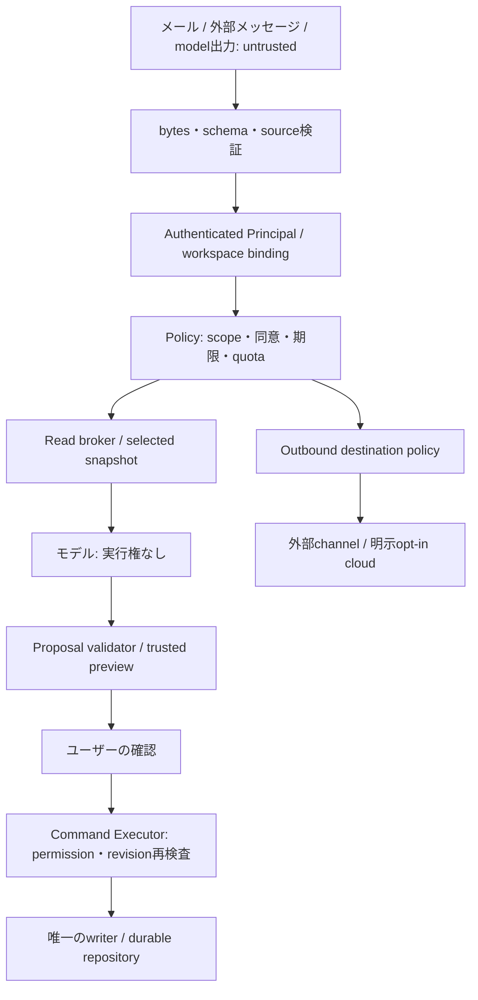

# Today V3 Security Model

## 2026-10-10: V2.1.0への移行

AI Chat・承認付きAI操作・Messaging共通基盤の正式開発対象を **Today V2.1.0** へ変更した。独立コピーで `2.1.0-alpha.1` の製品コードとMock/ローカル評価を実装した。具体的な実装状態は [V2.1実装記録](V2_1_IMPLEMENTATION.md)、[品質・残課題](V2_1_QUALIFICATION.md)を優先する。以下の元資料は2026-10-09時点の設計履歴として残す。「未実装/未承認/未実行」は元資料時点の記述であり、今回の結果を表す時はV2.1記録を参照する。

将来V3に残す範囲: GatewayWorkspace正本/永続ledger/常駐、実チャネルとiMessage、PWA実機・iOS・通知/共有、アカウント/同期/tenant/クラウド/商用。今回V2.0.3公開版・公式サイト・実アカウント・外部送信を変更していない。Qwenは未採用、iMessageは未対応、正式公開準備完了はNO。

---

区分: 設計と受入基準。**この文書の存在は対策実装・侵入試験PASSを意味しない。** V2の現行境界は[Security Model](SECURITY_MODEL.md)、保存privacyは[Privacy](PRIVACY.md)、悪用制限は[Abuse Resistance](ABUSE_RESISTANCE_PLAN.md)。

## 1. 保護対象・保証範囲

資産: tasks/events/Context、選択mail、会話、OAuth/API secrets、workspace/tenant binding、承認receipt、inbox/outbox、公式artifactとライセンス。

攻撃者: 未登録Messaging sender、偽造/replay webhook、悪意あるメール/文書/モデル出力、乗っ取られたchannel account、他tenant、侵害されたPlugin/dependency、資源消費を狙うclient。

信頼するものを最小にする: 決定的Application、認証済みruntime、限られたOS/operator、検証済みartifact。モデルは信頼しない。browser同origin codeは実行権を共有するため、現在のtrusted Pluginは独立sandboxではない。

公式配布物と運営するGatewayの能力を制限する。MIT OSSを第三者がforkして改造することまで技術的に禁止できるとは約束しない。hash、TypeScript型、Web Locks、promptは悪意ある実行codeを隔離する仕組みではない。

## 2. 信頼境界

モデルがprincipal・workspace・URL・tool catalog・承認を選ぶ経路を作らない。外部データの命令文は権限付与として扱わない。拒否してもCoreの保存・手動操作は維持する。

## 3. 認証・認可契約

### local BrowserWorkspace

現行NodeはHost/Origin/POST header/HttpOnly SameSite sessionを検査するloopback serviceで、SaaS accountsではない。local Chatでも明示pairing/session workspace bindingを検討し、同じMacの全processが安全だとは仮定しない。Ollama自体のlocal APIをインターネットへ公開しない。CORS許可は認証の代わりではない。

browserのread scopeはUIが固定したitem/fieldから選ぶ。ブラウザself-hostモードはユーザー自身が管理する単一workspaceであり、client inputを検査しただけで悪意あるclientからDBを隔離できるmulti-tenant設計になったとは言わない。

### Gateway / Messaging / 将来Cloud

- `Principal = {principalId, tenantId, sessionId, authStrength, grantedScopes, expiresAt}`は検証済み認証から生成。送信者の表示名・モデル出力・request bodyから代入しない。
- resource単位のworkspace ownershipとfield scopeをExecutor/Repositoryで検査。queryのtenant filterを外せないportにする。client supplied workspace IDだけで選択しない。
- 外部channelのlinkはToday側開始・provider側challenge・Today側確認、single-use/expiry/rate制限。scope revoke/account logoutでin-flightとqueueを無効化。
- 初期scopeは`today.schedule.read`, `today.tasks.read`, `today.context.read`。`mail.selected.read`, `calendar.selected.read`は別grant。write/admin/link/exportは初期OFF。
- multi-user公開GatewayはTLS・secure session・CSRF・account recovery・device revoke・tenant isolation試験が揃うまで提供しない。既存session cookieをaccount login実装済みと扱わない。

## 4. 同意とデータ最小化

| 同意              | 内容と適用範囲                                                                             |
| ----------------- | ------------------------------------------------------------------------------------------ |
| local model起動   | 利用runtime・artifact・RAM/容量、停止方法。起動しないCoreが既定                            |
| local Context利用 | source/item/field/time範囲、会話有効期限。メール全文を暗黙投入しない                       |
| remote AI送信     | provider/model/endpoint、送信内容、目的、保持条件、上限。同じlocal consentから派生させない |
| Messaging返答     | channel/thread/相手、返す情報範囲。local推論でも返答データは外部サービスへ出る             |
| history保存       | store/平文説明、保持・delete/export。初期OFF                                               |
| sync/cloud保管    | 別契約、保存場所・暗号化・鍵回復・削除・運用条件                                           |

同意receiptはscope・destination・policy version・expiryと関連づける。provider/宛先/field拡大は再同意。撤回後は待機処理を止め、済んだ外部送信の回収は保証しない。

現行Remote Model serverはconnected/sensitive dataを拒否しており、UI consentだけで通す設計ではない。V3で外部への選択mail送信を提供する場合は新しいserver policy・Google規約・検証を別承認で行う。現行boundaryを黙って緩めない。

## 5. 操作確認とcommit

Alphaはwrite toolsなし。Betaは新規作成を含む全Chat変更に確認を要求する。現行手動UIのactionPolicyをモデルの自動実行許可として流用しない。

1. schema allowlist・対象所有権・source provenance・曖昧性を検査。
2. アプリが対象title、変更前後、解釈した日時/timezone、件数、副作用、取消可能性をpreview生成。
3. 本人のtrusted UI確認でproposal hash/revision/identityに結び付いたsingle-use receiptを発行。後続のメッセージ確認は§11の独立gateと専用parserが同じbindingを検証した時だけ認める。
4. 実行直前にsession/grant/expiry/writer/現在revisionを再検査。変化なら再preview。
5. idempotency keyと効果をtransactional ledgerへ記録、durable保存を待つ。
6. actual resultを再読取りしてreceiptを表示。persist失敗/timeoutはFAILEDまたはUNKNOWN、成功と捏造しない。

ledgerとデータのatomicityがない保存方式では、クラッシュ後の重複防止を保証しない。初期browser writerでのjournal/reconciliationが必要で、既存IDB+mirrorがそれを満たすとは仮定しない。受入不能ならwrite機能をread-onlyへ縮小してreleaseする。

Messagingの「はい」「前に承認した」は確認にならない。初期の変更確認はToday UIへ戻し、後続の操作確認モードは§11で定める。メール送信・削除・課金・追加の外部共有・権限拡大は初期範囲外。承認済みthreadへの返信は独立したreply grantで認可する。localタスクのundoは履歴に基づき可能な場合だけで、外部送信のundo保証と混同しない。

## 6. 脅威と検証

| 脅威                  | 必須対策案                                                                          | gate / 停止条件                                                                          |
| --------------------- | ----------------------------------------------------------------------------------- | ---------------------------------------------------------------------------------------- |
| Prompt injection      | 外部sourceをdataとして分離、modelから権限を切り離す、tool catalog allowlist         | メールの命令からwrite/外部送信/secret取得が起きない。違反1件でHOLD                       |
| Tool hallucination    | schema・unknown field拒否、operation/target/time bounds、permission/revision再検査  | 任意URL/code/shell/Plugin/function拒否100% fixture                                       |
| 事実/実行の捏造       | source ID検査、決定的日時/検索、完了receiptのtrusted表示                            | 未接続を接続済みと表示、未commitを完了扱いならHOLD                                       |
| XSS/link漏洩          | text表示、HTML無実行、http/https scheme検査、外部linkは明示click、untrusted画像なし | javascript/data/file URL、markdown画像tracking、model HTMLを拒否                         |
| SSRF/secret漏洩       | endpoint preset/egress、redirect/DNS/IP再検査、ブラウザへsecretを返さない           | 任意fetch tool/metadata/private network/cloud redirectを拒否。localruntime allowlistは別 |
| Channel spoof/replay  | 公式署名/secret header、時刻window・event dedup、binding                            | wrong sender/thread/recipient/expired linkからmodel起動前に拒否                          |
| Echo/二重効果         | inbox/outbox、fromSelf/receipt、idempotent command ledger                           | duplicate/restart/timeoutでlocal effect増えない                                          |
| stale approval/TOCTOU | hash+revision+nonce+期限、commit直前再認可                                          | preview後変更・引継ぎ・revokeで拒否                                                      |
| user間漏洩            | 全query/mutationのtenant強制、cache/historyもtenant partition                       | A/B tenantのID列挙・cache hit・非同期応答で漏洩0                                         |
| 資源DoS               | raw bytes/token/queue/call bounds、単一推論、deadline、所有process停止              | overloadしてCore保存・復旧を継続。モデル停止が効かなければHOLD                           |
| 保存喪失              | READY/RECOVEREDだけでwrite、単一writer、settlement、backup                          | corruption/read failureをempty autosaveにしない。既存15障害ケースを維持                  |
| 同origin/Plugin侵害   | trustedのみ、dynamic codeなし、将来能力別broker/isolated process                    | Web Locksは隔離でない。untrusted extensionを提供しない                                   |
| supply chain          | frozen lock/action SHA/SBOM/NOTICE、artifact hash、保護CI                           | 既知blockerをgate削除で通さない。新identityを再qualify                                   |

攻撃用shell、network scanner、credential collection、任意code実行をChat/カスタム設定の能力にしない。正常な自然言語に見える入力でもpolicyを変えない。

## 7. 保存・秘密・ログ

- V2は平文IDB/localStorage。同じgithub.io originの別projectも信頼境界を共有する。subpath/worker scopeはstorage隔離ではない。機密サービス化時は専用origin等を別判断。
- API/OAuth keyはserver側のoperator管理storageで保持し、browser backup/history/diagnosticへ入れない。OS secret storage採用は別実装gate。パスワード/PAT/cookieを利用者にチャットへ貼らせない。
- OAuthは最小readonly scope・PKCE/state/session binding・revokeを保持。Gmail readonlyはGoogleのrestricted scopeであり、一般提供時のverification/security assessment適用を確認する。[Google scopes](https://developers.google.com/workspace/gmail/api/auth/scopes)
- defaultログはtrace ID、operation、型付きreason、duration、token/bytes、policy versionのみ。source本文/subject/URL/query secretを載せない。opaque IDも個人情報になり得るので保持上限を設定。
- Chat履歴初期OFF、optional7日/100turn候補。削除はlocal実体・index/cache・active Contextを対象とし、外部providerコピーの消去は別条件を説明。
- Full Disk Accessを要するBridgeは別OS account/個人情報範囲のOwner判断が必要。Today runtimeのsandbox成功をBridgeへ適用しない。

## 8. multi-device / 商用化の独立gate

Syncはappend-only operation ID・base revision・競合を扱う候補。clockのlast-write-winsだけで予定や訂正を消さない。migration/削除tombstone/復旧/同時編集/暗号化とkey recoveryを決めるまで実装しない。E2EEを採用するならserver AIで平文を読めない制約を設計に含め、単にTLSをE2EEと呼ばない。

SaaSはaccounts、tenant partition、abuse control、料金予約、利用規約/プライバシー、データ削除/保持、障害対応、サポートが別途必要。無料枠上限・残額未確認はSTOP、通知だけで課金上限を保証しない。課金・新契約・プラン変更はOwner判断。

MIT Coreの既存公開権利は維持する。fork抑制目的の逆行的license制限を設けない。source/model/serviceの権利と規約を別々に確認する。

## 9. 現状の重大課題と未検証

V2.0.3に新しい悪用成功を確認したという報告ではない。V3機能の導入前に解消すべき不足は、Chat専用境界、browser/Gateway正本、操作ledger、Messaging本人認証、外部送信同意、tenant分離。現在の同origin平文保存とtrusted Pluginは機密multi-user用途へそのまま拡張できない。

公開ruleset activeとPVR enabledは今回APIで確認。独立承認review0、required checksはNode22/24のみでBrowser checksは必須に含まれない。V3の認証・権限変更では独立review/Browser gateを追加する提案。ただし今回設定変更していない。Dependabot/secret scanning無効・CodeQL未構成はRelease時snapshotの記録で、現在の管理設定を再確認していない。現在の全dependency advisory調査も未実施。

実iPhone/Android、BFCache/OS crash・browser eviction、full React update、通知配送、Google実account、Bridge、外部Chat、第三者侵入試験は未検証。新規benchmarkは今回未実施。

## 10. release/incident停止条件

無承認write、scope外漏洩、secretログ、データ消失、identity不一致、未解決license/本人認証、free-firstを破る自動課金を確認したら該当機能を停止しHOLD。`fail → 原証拠保存 → root cause → 最小修正案 → 承認 → targeted → regression → 新identity qualification`を守る。

今回監査ではコード修正せず[Gap Analysis](TODAY_V3_GAP_ANALYSIS.md)へ対象・risk・試験を記録する。公開後の機密送信は回収不能で、rollbackは新機能停止/新修正版の公開まで。旧tag・receiptは改ざんしない。全有限テストの成功を脆弱性ゼロ保証にしない。

## 11. iMessage自動返信とchannel confirmationの安全契約

追加設計。**read grant、reply grant、operation proposal、operation confirmationは別権限**。事前のauto有効化はタスク変更の一括承認ではない。model inferenceはsend/commitを認可しない。

### 11.1 Mode gate

| Mode                   | 必須権限                                                     | 最後の権威                                                          |
| ---------------------- | ------------------------------------------------------------ | ------------------------------------------------------------------- |
| manual                 | bound sender/thread + draft scope、送信時single-use UI承認   | trusted UIとoutbox destination policy                               |
| auto read-only         | 上記binding + 有効なreply/read scope + mode opt-in           | 毎回のpolicy/revision/宛先検査、無許可変更は0                       |
| operation confirmation | 狭いoperation grant + proposal差分 + 本人の有効challenge返答 | 決定的confirmation parser、再認可、transactional ledger/sole writer |

scopeが未設定、mode policyのversionが変わった、instance認証/recipient変化、時計不整合、inbox/outbox persistence failure、grant失効なら送信・実行を停止。再起動でdefault autoへ移らない。modeの適用はtrusted UIから設定し、権限範囲や送信先を外部本文で変えない。

### 11.2 Bridge identityを本人性と混同しない

検証済みBridgeはevent輸送の出所を確認するもので、Apple Accountの現在の持ち主を完全に認証する証拠ではない。handle/phone/nameだけでは不十分。Ownerのtrusted UI登録、専用受信先、channel challenge、許可thread/recipient/account、Bridge instanceとsessionのbindingを要求する。

query passwordのあるREST URLをログ・診断・履歴へ残さない。署名不能なwebhookはhint扱いで認証済みsourceから再取得する候補だが、その方式の耐改ざん性も実機/実装レビューで確認する。Full Disk Accessや同じOS userの悪意あるprocessをこの契約だけで防げるとは主張しない。

group化/participant変更、別sender/recipient、forward/quote、self eventは拒否。誤った宛先へ「許可がありません」等を毎回返信しない。無関係thread/過去Messagesのデータを取得・保存しない。リンク済みアカウントの乗っ取りに対しては被害範囲をread field/single-operation scopeで制限し、機密/高影響はtrusted UI再認証へ戻す。

### 11.3 Message confirmation binding

PendingConfirmationのhash対象はcanonical operation/arguments、対象、before/after、workspace/principal/binding/thread/recipient、expectedRevision、policyVersion。nonce・期限はserver生成、初期TTL120秒、同threadでpending1件。modelからnonceを指定させない。

明示的に表示されたpreviewに対して、検証済みの新しい受信イベントで`確認 <challenge>`が完全一致した時のみconfirmation candidateとなる。無条件の「はい」、別操作への返答、モデルの引用、duplicate、期限切れを承認にしない。server clockで期限を判定し、senderのsentAtにより延命しない。

実行直前にbinding/grant/operation bounds/nonce/current revision/writerを再検査し、consumeとeffectとledgerを同一transactionへまとめる。previewを編集した場合は新nonce。revoke/停止/変化/expiryでinvalidateし、restart後は未確認pendingを失効させる。既にcommit済みoperationはlookupで結果を返し再適用しない。

初期の許可変更は可逆なlocal task/event、1件ずつ。bulk/deletion/外部Calendar変更/Gmail送信/権限拡大/課金は含めない。receiptのない変更やchannel保証不足はToday UIへ戻す。confirmationと返信送信は別ledgerで、結果返信のretryが変更を再実行しない。

### 11.4 自動返信の情報出力境界

通常会話に私的Contextを暗黙注入しない。live readとhistory両方のdata classificationを追跡し、grant撤回時にcache/draft/history由来の再出力も停止する。送信直前のrecipient binding・reply grant・source revision検査は生成開始時の確認と別に行う。

回答のsource IDs/fieldsは決定的に検証する。自由生成文の全意味を自動policyで保証することは未証明なので、autoで機密項目を扱う場合は固定templateへ縮小する。返答本文にモデル由来の「送信済み/更新済み」を採用せず、実行状態はtrusted receipt/templateで表示する。

最大返信/時・queue・生成・TTL、self/outbound ID、unknown deliveryを検査し、無限返信・同じeventによる再送・混雑通知のloopを止める。Bridge accepted、delivered、readは異なる状態で、照会できないdeliveryを確定しない。通信失敗をsilent cloud fallbackで補わない。

### 11.5 未解決gate

非公式Bridgeの規約適合、正規releaseとlicense、macOS実機、sender/recipient metadata真正性、基本send/receipt照会、SIP維持、権限の最小化は未確認。実iMessageへの接続・auto/send・product実装には別承認。Mock成功をこれらのPASSやBotの合法性証明にしない。
