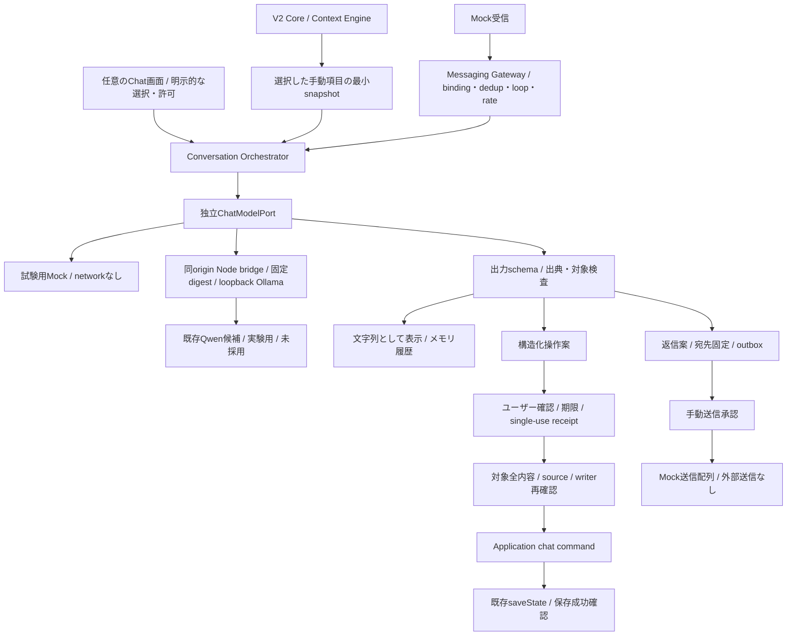

# Today V2.1.0 実装・移行記録

> 以下のAlpha実績は当時の履歴です。追加したオンデバイス / API経路と現在の仕様は[ブラウザChat仕様](V2_1_BROWSER_CHAT.md)を参照。AlphaのPASSを新candidateへ無条件に継承しません。

2026-10-10。開発版 `2.1.0-alpha.1`。**ローカル開発候補。正式Release・公開デプロイはしていない。**

V3で計画したAI Chat・承認付き操作・Messaging共通基盤をV2.1.0へ移した。製品コード・架空データ試験を今回実施した。過去の「設計のみ」「実装承認待ち」は元資料の作成時点の履歴であり、この指示の承認を取り消すものではない。

## 1. Phase 0の監査

基準: V2.0.3 commit `a0d2e013c942350e552e98db63ca820df36b011a`、tree `51963ae02fa3fe75af548cd11cd8f7237de583e6`。正式ZIP SHA-256 `d202c026264c66d4123f162d0abc6eacfe45fc14dc356caf467419d9a9c63146`。正式Releaseは[公開v2.0.3](https://github.com/kaelvance/Today-public-candidate/releases/tag/v2.0.3)。今回匿名APIで公開repo、tag、Release、commit/tree、配信manifestを再取得した。過去のMac/Ubuntu qualificationを新候補のPASSへ流用していない。

| 項目                                 | 確認した現行実装                                                                                  | 未確認・実験・未実装との区別                                                            |
| ------------------------------------ | ------------------------------------------------------------------------------------------------- | --------------------------------------------------------------------------------------- |
| 4画面、手動タスク・予定              | Today / やること / カレンダー / ふりかえり、登録・編集・完了・復元・保留・固定・検索              | 今回既存E2E/V2回帰を実行。実スマートフォンの全フローは未検証                            |
| Context / Router / Provider / Plugin | Domain/Application分離、Context構築・projection、独立Provider/Intelligence Router、制約付きPlugin | Routerの抽出契約をChatへ転用していない。任意コード実行Pluginは追加しない                |
| 保存・バックアップ                   | version3、IDB＋localStorage mirror、writer lock、破損/読込失敗停止、旧データ移行                  | DB名・保存key・schema/backupを変更しない。OS kill/evictionなど未検証                    |
| SW / Offline                         | 世代待機・precache失敗時の旧世代保持・オフラインshell                                             | 新Alphaのcache世代だけ分離。実OS lifecycleは追加検証が必要                              |
| Gmail / Google Calendar              | 既存readonly接続実装、架空API・失効等の試験                                                       | 実アカウント接続・権限追加は今回なし。Chat Contextでは接続データを除外                  |
| MLX / Ollama / Gamma                 | 既存抽出接続とモデル資料                                                                          | GammaのChat採用なし。今回のChatは別port。Qwen試験は[評価記録](V2_1_MODEL_EVALUATION.md) |
| OSS / 公開 / CI                      | MIT Kaito Kuon、既存CI・SBOM・SECURITY/PVR資料                                                    | V2.0.3公開維持。新Alphaは未push・未CI・未公開。finite testsを安全性保証としない         |

元のV2.0.3作業ツリー453ファイル（tracked446＋V3資料7）と公式サイトsourceは、開始前hashに対し終了時再照合する。開発場所は独立コピー `work/v2.1.0/source`、branch `development/v2.1.0-alpha.1`。元checkout・公式サイト・GitHubを変更しない。

## 2. 実装した構成



### Chat

- `src/chat/contracts.ts`、`context.ts`、`orchestrator.ts`、`models.ts`、`src/ChatPanel.tsx`。Coreの4画面を保ち、任意モーダルを追加。
- `ChatModelPort`はRouterから独立。user/assistant履歴、systemはserver管理。tool/system役割をclientから受け付けない。生のmodel tool callは拒否。
- 履歴は最大6完了ペア・メモリのみ。閉じる、許可撤回、共有範囲変更、モデル切替で破棄。Core backupへ混ぜない。会話の永続化・端末同期は未実装。
- ユーザー入力上限2000文字、本文予算1800 UTF-8 bytes（Context・履歴込み）、最大手動項目6件。全文を無断切捨てず、超過時は履歴削除/共有数削減を要求。serverは追加system/context投影を含むmessages3200 bytesも検査。実tokenizerによる厳密token計数は未実装。
- timeout30秒、会話ごと同時1、server全体同時1・session毎10回/分。取消後の遅延応答は採用しない。元の処理がsettleするまでbusyを保持。無断再試行・cloud fallback・model pullなし。
- Contextは選択した非demoのmanual task/eventだけ。title/status/time/importance/IDと、全参照が選択内に収まるContext relationを投影。description、メール、token、接続データを渡さない。現在時刻・timezone・60秒TTLを添付。serverがJST等の現地時刻を補助表示する。
- 出力はtext/citations/proposalのみ。出典IDは選択内に限定。HTML/Markdownの実行・リンクtool・shell/HTTP/file権限なし。

### 承認付き操作

- `src/application/chat-commands.ts`。既存 `makeManualItem`、Context reconcile、`saveApplicationState`へ接続する最小Application拡張。
- create: manual task/event。title必須、eventは正確なUTC日時必須。update: manual task/eventのtitle/status(active/done)/日時の**いずれか1項目**。delete/email/external write/source変更/任意fieldは不可。
- 期限・対象・変更内容を表示して明示承認。receiptはUUID、120秒、単一利用。内容はtrusted mapに保持し、UI返却コピーを権威にしない。推論開始時の全item内容へ束縛し、timestampだけでなく全値を照合。並行/再送、同名複数対象、no-op、staleは拒否。
- `App`の小さいcommit gateで保存中の他state更新を順序付け、writer内で既存保存をawaitしてからstateと成功表示を更新。保存失敗では成功表示・自動再実行をしない。独立DBへのモデル書込みなし。
- durable operation ledgerは未実装。reloadでreceiptは消える。再起動を跨ぐexactly-onceや外部message操作確認は主張しない。実Messaging writeを有効にする前のblocker。

### Messaging

- `src/chat/messaging.ts`。trusted UI binding、adapter/thread/sender/credential/expiry検査、自己送信/hops/replay/古いevent排除、5件/分、bounded inbox/outbox、conversation分離、revocation。
- 初期手動返信。Mock Adapterは送信配列へ書くだけ。ローカルモデル選択時は **Mock受信→実Qwen→Mock返信** も実行可能。
- 自動モードは共通Gatewayの契約試験のみ。事前bindingと正確な定型query `選択情報を確認` に対して決定的snapshot投影だけを返す。LLM自由文・操作案は自動送信しない。UIで実チャネルのautoを有効化する機能なし。
- outbox DRAFT/SENT/FAILED/UNKNOWN、宛先固定、expiry、二重承認拒否。明確なFAILEDのみ手動1回retry、UNKNOWNは再送禁止。配達/既読・永続dedupは未実装。
- `server/telegram-preview.mjs`は公式APIの**inert contract preview**。架空private updateをallowlist照合し、注入したfixture関数でsendMessage request/resultを検査。実fetch/token/account/long-poll/webhookは実装していない。実Telegram接続試験のPASSではない。
- iMessage Adapterは**未対応**。Apple公式Bot APIを仮定しない。BlueBubbles Private APIはSIP無効化を要求するため採用対象外。SIPを維持したbasic BridgeのOS適合・scope/binding/規約・安定性は未確認。ブラウザ閉鎖時GatewayからIDBへ直接接続できない。

## 3. ローカル実行

```sh
pnpm install --frozen-lockfile
pnpm build
pnpm start
```

`http://127.0.0.1:4173/` の「Today AI Chat」を開く。初期は試験用Mock。共有対象と許可を選び、例 `タスク「読書」を追加` → 内容確認 → 承認で保存。Mockが実AIでないことを表示する。

Ollamaは利用者が既に導入・取得したruntime/modelを別に管理する。Todayが取得・起動することはない。評価候補を試す時だけ `.env.local` に `TODAY_CHAT_MODEL`、`TODAY_CHAT_DIGEST`（64桁manifest digest）、`TODAY_CHAT_OLLAMA_URL`（numeric loopback HTTP root）を設定して再起動。secretは不要。envはGit非追跡。設定がない/不正/モデル停止/digest不一致ならChatを停止し、Coreは継続。

候補Qwen `qwen3.5:4b` は本記録では未採用。GGUF重みをrepoへ同梱しない。公開Pagesから利用者loopbackへの自動接続、開発者Macの公開backend利用、外部AIへの送信はしない。

## 4. V3に残す範囲

GatewayWorkspace正本・明示移行・durable ledger/inbox/outbox、ブラウザ閉鎖時の常駐、実メッセージ接続と本人性、iMessage、PWA実機/ネイティブiOS、通知/共有、アカウント・安全な同期・tenant分離、クラウドAI同意/費用管理、商用提供。同期・商用化はV2.1完成の必須条件へ自動追加しない。

7点のV3資料は削除せず、先頭の移行注記から本資料を参照する。[Model](V2_1_MODEL_EVALUATION.md)、[Security](V2_1_SECURITY_REVIEW.md)、[Qualification / 残課題](V2_1_QUALIFICATION.md)に責務を分ける。
